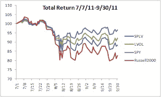
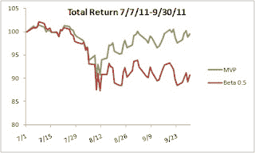

<!--yml
category: 未分类
date: 2024-05-12 20:44:10
-->

# Falkenblog: LVOL vs. SPLV

> 来源：[http://falkenblog.blogspot.com/2011/10/lvol-vs-splv.html#0001-01-01](http://falkenblog.blogspot.com/2011/10/lvol-vs-splv.html#0001-01-01)

There are two low vol ETFs out there, and there's one main difference.

[LVOL](http://www.russelletfs.com/Products/LVOL_Index.aspx)

is Russell-Axioma US Large Cap Low Volatility Index, and is drawn from the Russell 1000\.

[SPLV](http://www.invescopowershares.com/products/overview.aspx?ticker=SPLV)

is the PowerShares S&P500 Low Volatility Fund, and is drawn from the S&P. Thus, SPLV is more large cap, LVOL more small cap.

If we look at the time series since they both have been available (7/1/11), we see the SPLV has done much better than the LVOL, just as the S&P500 did better than the Russell 1000 over this period.

Looking at

[my own indices](http://www.betaarbitrage.com/)

, I too see that my US Minimum Variance Portfolio drawn from the S&P500 has outperformed my Beta 0.5 portfolio that is drawn from the Russell 1000, again primarily reflecting the higher cap bias on the MVP portfolio.

This highlights that there are many factors and these often explain short-term performance independent of any alpha. I think size is something to account for, so it's very important to know your benchmark, whether it is large cap or small cap, when implementing a low volatility strategy.