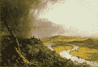

<!--yml
category: 未分类
date: 2024-05-12 22:28:47
-->

# Falkenblog: Landscapes Rule

> 来源：[http://falkenblog.blogspot.com/2009/01/landscapes-rule.html#0001-01-01](http://falkenblog.blogspot.com/2009/01/landscapes-rule.html#0001-01-01)

Data suggest people from all cultures tend to like landscapes. These painting have open spaces, with big trees with branches towards the ground, a river, a view between two mountains, animals, flowering and fruiting plants, and lastly, a path that one can follow. Thus, modern artists take note: in 100 years no one will care about your avant guard take on man's inhumanity to man, or his banality, as represented by a bunch of soup cans. It's funny listening to this guy note that people though art demand was much more culture dependent.

<embed type="application/x-shockwave-flash" src="http://bloggingheads.tv/maulik/offsite/offsite_flvplayer.swf" flashvars="playlist=http%3A%2F%2Fbloggingheads%2Etv%2Fdiavlogs%2Fliveplayer%2Dplaylist%2F17452%2F35%3A45%2F38%3A33">