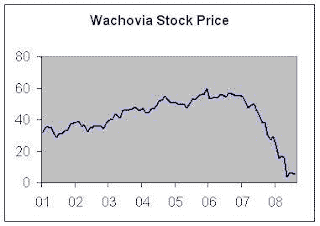

<!--yml
category: 未分类
date: 2024-05-12 21:51:52
-->

# Falkenblog: Lesson of Wachovia

> 来源：[http://falkenblog.blogspot.com/2009/08/lesson-of-wachovia.html#0001-01-01](http://falkenblog.blogspot.com/2009/08/lesson-of-wachovia.html#0001-01-01)

Wachovia was considered the gold standard of risk management for years. I remember in private discussions with regulators and consultants, one would always defer to the wisdom of Wachovia, because they were considered a 'best practices' bank in risk management.

But then Wachovia agreed to purchase Golden West Financial for $25.5 billion in 2006, before any mortgage problems had surfaced. That year Golden West Financial was named the "Most Admired Company" in the mortgage services business by Fortune magazine, and had over $125 billion in assets, compared to Wachovia's $540 billion. It is important to remember that in real time, companies that blow up are considered excellent before they cause real damage. If they weren't, they wouldn't cause any damage. Enron, Madoff, Countrywide--these were all considered excellent firms at their height, with only a handful of critics (certainly not the regulators).

Wachovia began to experience heavy losses in its Golden West portfolios over the next two years. In the second quarter of 2008, Wachovia reported a much larger than anticipated $8.9 billion loss. Wachovia's stock price plunged 27 percent during trading on September 26 2008 due to the seizure of Washington Mutual the previous night. On the same day, institutional depositors withdrew money from their accounts in order to drop their balances below the $100,000 insured by the FDIC—an event known in banking circles as a "silent run." On October 3, 2008 Wells Fargo announced it had agreed to acquire Wachovia for $15.1 billion in stock.

This is a reminder of how institutions can have really great 'risk management', but major corporate actions can make this all irrelevant. Similarly, companies with lousy 'risk management' can avoid catastrophes by avoiding these disasters. This makes it difficult to assess risk, because you have two, independent risks: the level of rigor and discipline in standard operations, and the chance they buy something really stupid. It highlights that mortgage CDO risk is really not 'more difficult' than most risks facing your average equity holder.