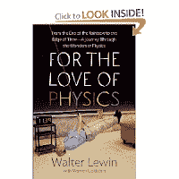

<!--yml
category: 未分类
date: 2024-05-12 20:40:59
-->

# Falkenblog: Lewin's Love of Physics

> 来源：[http://falkenblog.blogspot.com/2011/11/lewins-love-of-physics.html#0001-01-01](http://falkenblog.blogspot.com/2011/11/lewins-love-of-physics.html#0001-01-01)

Walter Lewin is an MIT physics professor, and wrote a pretty fun book entitled

[For the Love of Physics](http://www.amazon.com/Love-Physics-Rainbow-Journey-Through/dp/B005GNIX32/ref=sr_1_2?s=books&ie=UTF8&qid=1320279183&sr=1-2)

. It's a nice romp through fun facts of physics, such as why rainbows only appear when the sun is behind you. One of the more interesting parts concerns his investigation of Galileo's Square-Cube law.

Galileo's

[Dialogue Concerning Two New Sciences](http://galileo.phys.virginia.edu/classes/109N/tns1.htm)

contained what he considered to be one of his most profound insights: the square-cube law. If two cubes are made of the same material then they will have the same density. Yet since the two cubes have different area to volume ratios they will likewise have different stress at the base of each cube. If too much stress is placed on an object then it will fail, or in this case a large cube has a much greater possibility of collapsing. This is why sandcastles can only be a few feet high.

Galileo applied this to animals, what we now call

[allometry](http://en.wikipedia.org/wiki/Allometry)

, and noted that a this implies the diameter of bones should be proportional to their length so that length

³

=k•diameter

²

, or diameter=k•length

^(1.5)

. The simple support required of bones implies limbs get thicker and thicker as animals get bigger, which is why rhinos and elephants are pretty thick. Bones comprise about 8% of the weight of a mouse, 14% of a goose or dog, and 18% of a man.

Also because of the Square-Cube Law, larger animals have less relative muscle strength than smaller animals. Both the muscle strength and bone strength are functions of the cross sectional area, while the weight of the animal is a function of volume. It is because of relative muscle strength that an ant can lift fifty times its weight while a human can lift an amount equal to its own weight, and an Asian elephant can only lift 25% of its own weight. The greater muscle to weight ratio of smaller animals is what allows them to jump higher than several times their own height, while at the other extreme an elephant can not even jump.

Back to Lewin, he actually looked at various animal bones from MIT's museum. Comparing a raccoon with a horse femur, he found the horse femur should be 6 times thicker than a raccoon's. It turned out 5 times thicker, which is close. Then he compared a horse to a mouse, and the thickness was only 70 times thicker, not the 250 times thicker as predicted by their lengths. The elephant femur was only 120 times thicker than a mouse's femur, not the 1000 times as predicted.

It appears that the structure of bones is different, bone chemistry changes along with its size. Thus, the fact that dinosaurs were the size of 12 bull elephants with

[leg bones of similar diameter](http://en.wikipedia.org/wiki/Tyrannosaurus)

, need not be explained by an

[expanding earth theory](http://www.dinox.org/english/dinolink.htm)

(the idea that the earth was smaller back then, so gravity wasn't as strong). So, Galileo's square-cube 'law' is really an approximation for the moderate spectrum of animal sizes, something that explains a lot but doesn't generalize like gravitation, which Newton used to explain the fall of an apple and the orbit of the moon.

Then again, perhaps even gravitation does not scale.

[Dark matter](http://en.wikipedia.org/wiki/Dark_matter)

was introduced to explain the fact that galaxies rotate in a way very unlike our solar system. In our solar system the gravity vs. centripetal force generates the pattern where the period of a planet (T) and the mean distance from the sun (R) are related by a constant ratio for T

²

/R

³

, something observed by Kepler then proved by Newton 70 years later. Thus, Mercury has an orbit of 88 days, Neptune 165 years. Galaxies don't do that, with the outer regions moving almost as fast as the center stars.

[Dwarf galaxies](http://earthsky.org/space/study-of-dwarf-galaxies-deepens-mystery-of-dark-matter)

are even worse, looking more like an evenly distributed swarm of bees, indifferent to clumping or spinning. The idea that the space is suffused with unobservable dark matter fixes this problem, but it's a fudge, because it 'appears' only as a solution to this problem. Perhaps gravitation doesn't scale at that dimension.