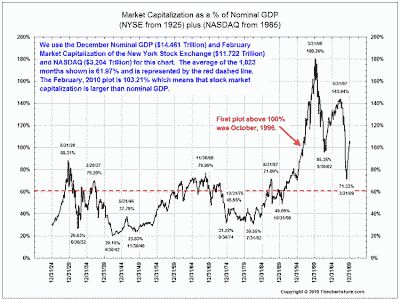
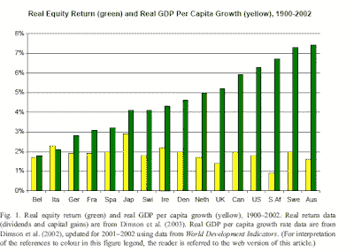

<!--yml
category: 未分类
date: 2024-05-12 20:56:18
-->

# Falkenblog: Limits to Growth

> 来源：[http://falkenblog.blogspot.com/2011/05/limits-to-growth.html#0001-01-01](http://falkenblog.blogspot.com/2011/05/limits-to-growth.html#0001-01-01)

Martin Feldstein

[writes](http://online.wsj.com/article/SB10001424052748704330404576291452454935100.html?mod=googlenews_wsj)

an op-ed in the WSJ where he asserts a 5.5% real equity growth rate. This is a common assumption, implying an expected 7.5% nominal equity growth rate going forward, just as

[CalPers](http://falkenblog.blogspot.com/2011/03/calpers-rosy-assumptions.html)

and many other large funds assume.

Consider that profits are a pretty constant portion of GDP, around 10%:

Now, as Jeremy Siegal notes, you can have higher-than-GDP earnings per share growth in stocks if companies continually repurchase shares, but here's a graph from

[Barry Ritholz](http://www.ritholtz.com/blog/2011/02/nyse-market-capitalization-as-of-gdp/)

on the valuation of the market relative to our GDP over time: it's gone up, but it can't go up forever.

If valuations stay about the same portion of GDP, the average return to a dollar invested is capped by the growth rate of earnings. Remember that these profits are then used for dividends and buybacks.

Fama and French

[argued](http://onlinelibrary.wiley.com/doi/10.1111/1540-6261.00437/abstract)

that the US 1950-2000 period that is so prominent in academic minds was truly anomalous:

> the dividend-price and earnings-price ratios fall from 1950 to 2000: the cumulative percent capital gain for the period is more than three times the percent growth in divdends or earnings. All valuation models agree that the two price ratios are driven by expectations about future returns (discount rates) and expectations about dividend and earnings growth.

This means, the second half of the 20th century was abnormal, even with hindsight looking at dividends and earnings. Expecting greater than 3% real returns out of stocks relies on a lot of hope.

Then again, you can take the view of Jay Ritter, who

[notes](http://bear.warrington.ufl.edu/ritter/PBFJ2005.pdf)

very little correlation between equity returns and GDP growth cross-sectionally, looking at data from 16 countries over 100 years:

As an empirical matter, knowing a country's GDP growth is a pretty lame indicator of even its long run stock market return. Valuation (P/E fluctuations), the fraction of corporate profits paid out to shareholders, and the probability of catastrophic loss due to hyperinflation, revolution, war, are all very important in these 100 year samples.

But ultimately, a 3% top-line return seems the most reasonable equity premium estimate, and the return to shareholders will probably be below that due to transaction costs and adverse timing. The 5.5% return bandied about is a bias from a very biased sample--the US post WW2--not representative of general experience.