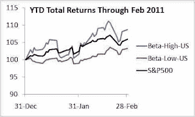

<!--yml
category: 未分类
date: 2024-05-12 21:06:49
-->

# Falkenblog: Low Vol Presentation in NYC March 16

> 来源：[http://falkenblog.blogspot.com/2011/03/latest-low-vol-conference-in-nyc-march.html#0001-01-01](http://falkenblog.blogspot.com/2011/03/latest-low-vol-conference-in-nyc-march.html#0001-01-01)

Above are the total return charts for

[low and high beta stocks](http://www.betaarbitrage.com/)

, where portfolios were created using 100 stocks out of the top 1500 non-ETF US equities. You can see that high beta stocks are outperforming, low beta underperforming, by a couple percent relative to the S&P500\.

The latest low vol conference is at some New York financial club on March 16, $50 at the door. That's not close to me, so I won't be going, but looks interesting.

Time: 5:30 PM – 8:30 PM

Venue: Patrick Conway's Pub & Restaurant (downstairs), 40 E 43rd St (between Madison & Vanderbilt), NY, NY – ½-block from Grand Central Station.

Speakers are:

> Ruben Falk, Senior Manager, Capital IQ, "Leveraging Minimum Variance to Enhance Portfolio Returns"
> 
> Yin Luo, Managing Director and Head of Global Quantitative Strategy, Deutsche Bank Securities, "The Puzzling Relationship between Risk and Return - Defensive and Offensive strategies".

Interestingly, Falk seems to emphasize how to layer this onto a value play (see

[here](http://qwafafew.org/images/uploads/Leveraging%20Minimum%20Variance%20to%20Enhance%20Portfolio%20Returns_final.pdf)

). He suggests low volatility investing 'works' (ie, dominates the indices) because of 'leverage restrictions', the

[Frazzini and Pedersen argument](http://falkenblog.blogspot.com/2010/12/frazzini-and-pedersen-simulate-beta_15.html)

. Lou of DB, meanwhile, highlights "although they have some intriguing properties, low risk is not necessarily one of them". He's one of the coauthors of the white paper I

[discussed](http://falkenblog.blogspot.com/2011/02/deutsche-bank-on-mvp-investing.html)

last week, and I think this refers to the fact that his MVP had some bad returns in the last financial crisis. But his white paper had a rather nuanced view of the data I found almost nonsensical, such as when DB wrote "the strategy does not actually position itself so that low-volatility stocks outperform; instead it aligns itself so that lower risk portfolios outperform." I don't think the MVP portfolio, with short positions, is the essence of the anomaly, rather, the simply flat to negative beta/vol relation to returns. As I said, I think they're gilding the lily.