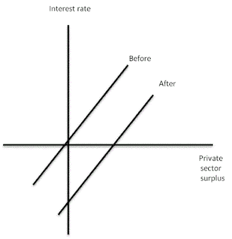

<!--yml
category: 未分类
date: 2024-05-12 21:23:37
-->

# Falkenblog: Macro Aggregation Fallacies

> 来源：[http://falkenblog.blogspot.com/2010/08/macro-aggregation-fallacies.html#0001-01-01](http://falkenblog.blogspot.com/2010/08/macro-aggregation-fallacies.html#0001-01-01)

It would be very convenient if the macro economy could be steered like a big oil tanker using a few inputs. Sure, it's hard to steer an oil tanker, but it's feasible. You just need an objective (full employment!), inputs (a map and a clear view), and control variables (the rudder, engine speed). After all, Newton took all those epicycles, and merged them into simple F=G*m

[1]

mm

[2]

/r

²

, so that's what scientists do. I agree it's nice when it happens, but sometimes it's not possible, and it's obviously not true that historians know nothing merely because they don't know math or statistics.

Paul Krugman

[notes](http://krugman.blogs.nytimes.com/2010/08/17/notes-on-koo-wonkish/)

that there's a simple relation between the 'private sector surplus' and the interest rate. He uses graph above to show that the higher the interest rate, the more the private sector--consumers plus the businesses they own--will save.

Fine enough, that's all

partial

equilibrium analysis. That is, the capital goes outside this system, and the price of riskless capital (interest rate) is set exogenously. Supposedly:

> in normal times the central bank can reduce interest rates enough to set this surplus at zero, or no larger than the public sector deficit, thus ensuring full employment

In stressed times after a bubble (eg, the 'after' line above), the private sector tries to run a big surplus as it pays down debt. This causes recessions, which can be mitigated if not eliminated via countercyclical budget deficits by the public sector.

This argument would be tenable if it were 1936 and people never tried it, but it has been tried over and over and if a government could spend itself to prosperity and stability, a couple such countries would demonstrate this. Instead, we have the examples of the contrary, where fiscal restraint and modest automatic stabilizers were consistent with the wealthier countries post WW-II.

But what I love is the way Krugman totally ignores the heterogeneity of investment and employment, and simply thinks that people and companies are saving 'too much', and so anti-savings by the government would offset this, leading to full-employment bliss. That kind of thinking is profoundly misleading.