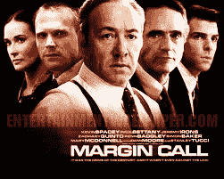

<!--yml
category: 未分类
date: 2024-05-12 20:40:09
-->

# Falkenblog: Margin Call the Movie

> 来源：[http://falkenblog.blogspot.com/2011/11/margin-call-movie.html#0001-01-01](http://falkenblog.blogspot.com/2011/11/margin-call-movie.html#0001-01-01)

Margin Call was an excellent movie, in terms of its direction and acting. The nightime scenes were emphatically in the darkness of night, even though every time I've worked after dark, we simply turned on all the lights (for some reason they would have meeting in the dark with ominous screens lit around them). Life isn't as simple and clear as in movies, which is why I like them when they are good.

But, the key was in creating an event that provokes a crisis, one that engenders all sorts of soul searching, backstabbing, pain, and ultimately resurrection. The event in this case was that the fired risk manager, the always awesome Stanley Tucci, highlights that the value-at-risk is greater than the value of the firm. Now, they don't say what horizon this VAR was for, but that doesn't really matter. The key is, everyone supposedly knows 1) the value of their portfolio and 2) stress-test and value-at-risk numbers for that portfolio. Presumably, as best as I could make out, the really shocking VAR used current 'volatilities' as opposed to stale historical ones, which given the VIX was at 15 for a long time, then peaked at 80, could have been an issue.

Since when was a parameter like 'volatility' not presented with the results? In my experience, management isn't well versed on VAR details, but they are good on what makes a relevant stress test or assumed volatility, so I can't imagine this being as important as the movie implied (ie, they all got together for a 4 AM meeting and decided to cover their exposure the next day). The idea that someone updated VARs for current volatilities, and discovered their portfolios were too risky and had to be exited immediately, is pure Hollywood.

The risk, presumably, was merely from their pipeline of assets that they held in the process of creating various derivatives. If that was their total risk, they had an incredibly high leverage.

But, that's all sniping. I thought it was a pretty good movie. The problem is that if you discovered that mortgages were overpriced in 2008 by 20%, that wouldn't imply the amount of panic showed in the movie. You would have weeks, if not months, to exit positions, not the 'day' the movie used. Big mistakes like that are systematic errors that are not going to change overnight. Even Enron's stock took months to fall, so it's never the case you have to sell your entire portfolio of an asset overnight, especially for something correlated with so many highly liquid alternative assets.