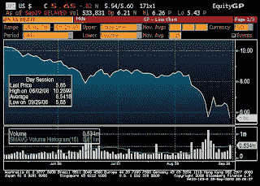

<!--yml
category: 未分类
date: 2024-05-12 22:55:31
-->

# Falkenblog: Market Intervention

> 来源：[http://falkenblog.blogspot.com/2008/09/market-intervention.html#0001-01-01](http://falkenblog.blogspot.com/2008/09/market-intervention.html#0001-01-01)

Most closed-end funds are at a steep discount to Net Asset Value, many around 25%. That is, you can buy $100 worth of equities or bonds, for $75, because everyone is selling. This would seem to suggest the market is panicking, and a solution would be to force some buying, and put the market back in order.

But market prices are symptoms of reality, not so much the cause, and prices exist in a complex constellation we rarely fully understand. Thus, the effect to eliminate short selling has potentially made things worse, because it really hurts all those who need to hedge to make markets in other products such as options or convertible bonds. Note how the fund JPC, which mainly owns convertibles, has tanked in recent days, in part because convertible bond owners can't hedge their positions, so demand a discount to bear the risk.

Top down cures create problems policy makers rarely anticipate. I bet the dislocation by option and convert markets is worth the one-time boost from banning short sales. I don't have an opinion on the $700B bailout, because I haven't seen the details of what they are buying, and that makes a big difference. But I do know shutting down some markets is no way to boost the overall efficiency of the financial sector