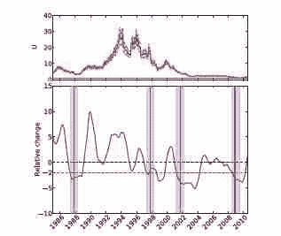

<!--yml
category: 未分类
date: 2024-05-12 21:02:41
-->

# Falkenblog: Market Mimicry and Panics

> 来源：[http://falkenblog.blogspot.com/2011/04/market-mimicry-and-panics.html#0001-01-01](http://falkenblog.blogspot.com/2011/04/market-mimicry-and-panics.html#0001-01-01)

A bunch of physicists (Harmon, de Aguiar, Chinellato, Braha, Epstein, Bar-Yam) have an

[intriguing paper](http://arxiv.org/abs/1102.2620)

about cascades. They call it 'mimicry', but

[Ivo Welch](http://www.jstor.org/pss/2329120)

really mined this field for a while, and while I think he gave it a good try, it didn't yield much. We know that in bubbles there's a lot of people doing what everyone else is doing on the way up and down. Correlations go up. It's interesting to model this as a rational outcome, as a situation in which every subsequent actor, based on the observations of others, makes the same choice independent of his private signal. In an information cascades everyone is individually acting rationally. Even if all participants as a collective have overwhelming information in favor of the correct action, each and every participant may take the wrong action. Even though a million people may have chosen one action, seemingly little information can induce the next million people to choose the opposite action. Fragility is an integral component of the Informational cascades theory.

The bottom line is that a theory should be able to not merely explain the past, that's hindsight, not science. It should predict. And these models haven't been successful here, so that thread has kind of dried up.

So, here's some physicists trying again. They generate the simple time series graph above. The top graph is a measure of dispersion, so a high number means that stocks are pretty uncorrelated, the lower number means stocks are highly correlated. They find that 1) stocks have become a lot more correlated over the past 15 years and 2) the change in this metric over the past year is a significant predictor of future crises. The bottom time series shows that prior to big moves like the 1987 crash, LTCM crash, 2001 crash, and 2008 crash, this measure moved relatively downward prior to them all. It's not perfect, but I like the unpretentious way they framed the problem and presented their results. It's not overfit.