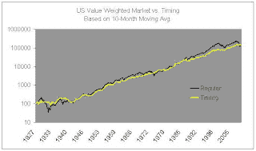

<!--yml
category: 未分类
date: 2024-05-12 21:49:47
-->

# Falkenblog: Market Timing Using a Moving Average

> 来源：[http://falkenblog.blogspot.com/2009/09/market-timing-using-moving-average.html#0001-01-01](http://falkenblog.blogspot.com/2009/09/market-timing-using-moving-average.html#0001-01-01)

Mebane (me-bany? mee-ban?) Faber has a well-read paper on the SSRN concerning market timing

[(A Quantitative Approach to Tactical Asset Allocation](http://papers.ssrn.com/sol3/papers.cfm?abstract_id=962461)

). I think this because the article is pretty simple, and it seems to work. It's incredibly easy to understand, accessible to anyone who uses Excel. He took the 10 month moving average rule proposed by Robert Siegel in his 2008 edition of

Stocks for the Long Run

, and found it worked in a variety of markets. I've seen a lot of market timing rules and find most stink, so I looked at the data myself, expecting it not to work.

I used the monthly data from Ken French's website. I went long the market if the index was above its 10 month moving average, went to T-bills otherwise, where 'the market' is the value-weighted US composite. The arithmetic return was slightly higher simply always being long (10.7% vs. 10.0%), but given the volatility of the long-only rule was 50% higher, its geometric return was about the same (9.3% vs. 9.2%). The Sharpe ratio using this index data suggests the market timing rule significantly helps one's investment, taking it from 0.30 to 0.46 in this 1926-2008 period.

US 1927-2008
Long vs. Market Timing Based on 10-Month Moving Avg.

|  | Regular | Timing |
| GeoRet | 9.3% | 9.2% |
| ArithRet | 10.7% | 10.0% |
| StDev | 19.0% | 12.2% |
| Sharpe | 0.30 | 0.46 |

The result is pretty robust, in that it does not drop off dramatically using a 6-month moving average, or an 18-month moving average.

You can see that the main periods of outperformance were from the 4 big bear markets: 29-33, 73-75, 2000-02, and 2007-08\. Perhaps in a simple moving average rule is a wise investment strategy. I would want to look at international data to become more certain, but it's interesting.