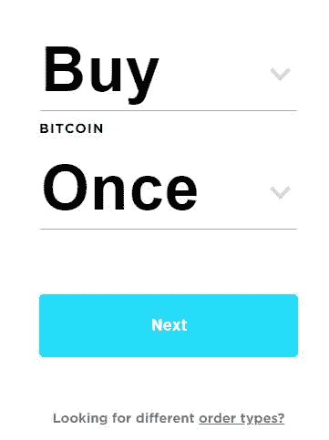

<!--yml
category: 未分类
date: 2024-05-12 19:59:24
-->

# Falkenblog: Median Anonymous Crypto Exchange Costs 1.5%, Sometimes 100%

> 来源：[http://falkenblog.blogspot.com/2019/06/median-anonymous-crypto-exchange-costs.html#0001-01-01](http://falkenblog.blogspot.com/2019/06/median-anonymous-crypto-exchange-costs.html#0001-01-01)

|  |
| Gemini's Order GUI |

Many of the big exchanges like Gemini or Coinbase do not have lots of alt-coins, and if you don't have an account the process of creating one can take days if not weeks. They also can make it hard to place orders, as Gemini's default trade mode is incredibly infantile. Further, these exchanges put up significant hurdles for market makers, and the only thing that prevents collusive tactics is free entry. Regulators are happy to prevent competition if they can make sure they have control over who gets to trade what.  Nonetheless, when you can trade directly the markets are pretty tight for small size, under 0.1% bid-ask spread for trading 1 bitcoin.

Coin shifters can be used anonymously and instantly for most traded crypto coins, which is very convenient. Thus I did not include ShapeShift, which regrettably, though understandably, yielded to regulatory authorities last year and requires a full KYC (regulators gave them no choice).

I sent bitcoin amounts of between 0.3 and 1.0\. The costs were around 1.5% for the major shifters. While CoinSwitch does seem significantly better, around 1.05%, there was some significant variability, so this could just be sampling error around an equilibrium cost of 1.5%. Either way, you should expect to pay--all in--much more than the 0.5% often advertised. This really isn't so bad, because Gemini charges 1%, and it would be nice if one of these shifters actually said that their total cost is 1.5%, because it would signal honesty.

Cost of Trading BTC to ETH

BTC amounts 0.3 to 1.0. **Cost **here is defined as the difference between the market price at the time I sent coins and the implied price from the actual number of coins I received.

Transactions take about 1-2 hours and depends on blockchain traffic as expected.

Flyp.me was quick, but they cost significantly more than alternatives, and they only allowed up to 0.3 bitcoin per transaction.

Many post explicit fees, usually around 0.5%, but these are really a distraction because most of the money brokers make is not explicit. This often confuses people, as when E-Trade or some other broker tells customers they pay only 10$ a trade (or even zero) because most of the cost of trading is in the bid-ask spread. A broker either has specialists making markets off of their customer flow or has sold their flow to specialists making markets. In equity markets, while I was trading at a large hedge fund and analyzed over a billion USD in trades, I found the explicit fees were about 1/4 the cost of trading on small orders (those without market impact, ie, about the size of the top-of-the-book size).

The only way to see how much an exchange charges is to compare the average execution price to the market price at the time of the order, as this combines the explicit and implicit fees. Once you send a coin to a coin shifter and it appears on the blockchain, the shifter can be confident it is getting that coin because the size of these orders is usually below 2 BTC, which is too small to be worth engineering a malicious double-spend. Thus, at that time the shifter can then make the offsetting market trade certain they are hedged, and so that is the time I use to benchmark my fills.

n.exchange was the only one to simply keep my bitcoin. N.exchange has acknowledged my trade, and I have checked in every couple of days to inquire about its status, and they keep telling me the servers are undergoing maintenance. It's been over two weeks [1 year!], and there's no message on their main page about this issue.

n.exchange highlights the importance of trust on the blockchain. Though anonymity is an important crypto principle, reputation is still important. It is costly to learn whether someone is trustworthy, as invariably trades on the blockchain are not done via secure atomic swaps, but rather, you send bitcoin (etc), and hope they send something back. The process of learning if they are scammers takes a lot of time, and occasionally you lose all your money.