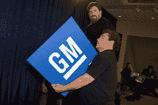

<!--yml
category: 未分类
date: 2024-05-12 21:59:38
-->

# Falkenblog: Meet the New GM, Same as the Old GM

> 来源：[http://falkenblog.blogspot.com/2009/06/meet-new-gm-same-as-old-gm.html#0001-01-01](http://falkenblog.blogspot.com/2009/06/meet-new-gm-same-as-old-gm.html#0001-01-01)

From the WSJ this photo is captioned "Workers took down a sign after a speech by GM CEO Fritz Henderson in New York Monday." In the speech, Henderson promised that GM will be 'leaner and quicker'. I'm no sign removal expert, but I see

three workers

in that picture (two faces, one set of hands behind sign), and I'm thinking they could have done that job with at most two workers.