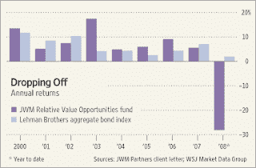

<!--yml
category: 未分类
date: 2024-05-12 23:25:05
-->

# Falkenblog: Merriweather does it again

> 来源：[http://falkenblog.blogspot.com/2008/03/merriweather-does-it-again.html#0001-01-01](http://falkenblog.blogspot.com/2008/03/merriweather-does-it-again.html#0001-01-01)

The basic advantage of a hedge fund investing in corporate bonds is to take advantage of the stale pricing in these illiquid securities. You can easily game the Sharpe ratio because they hide the true volatility of these assets (just look at the NAV of convertible bond funds like JPC vs their market values. If you could mark at the NAV, that is, the market value of the bonds, they are great trades. But if you trade the market value of the funds, which tries to put more realistic, and thus more volatile market pricing, on these portfolios, they are losers.

Thus it seems that Merriweather's

[bond fund](http://online.wsj.com/article/SB120658664128767911.html?mod=hps_us_whats_news)

merely applied leverage on corporates, and lo and behold, that blew up. Given their relative strength in the last recession, it was probably weighted towards financials, which did relatively well in the 2001 debacle, but is doing horribly now. I would stay away from any corporate bond hedge fund because theres simply isn't enough return in these things to justify their fees. Either they have an angle on the debt-equity arb or play the distressed game, where I do think one can make sufficient hedge fund returns. But if they are merely playing traded corporates, there's no there there. The average spread over time in B rated bonds, after transaction costs, is not measurably above libor. You would have to foresee every credit crunch to make money, a systematic trade that is implausible, to make money