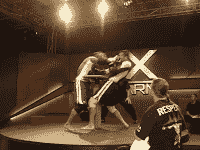

<!--yml
category: 未分类
date: 2024-05-12 22:46:09
-->

# Falkenblog: Moderation in All Things

> 来源：[http://falkenblog.blogspot.com/2008/11/moderation-in-all-things.html#0001-01-01](http://falkenblog.blogspot.com/2008/11/moderation-in-all-things.html#0001-01-01)

I love Mixed Martial Arts because the combination of wrestling, ju-jitsu, and boxing is a great combination, requiring athleticism and considerably more strategy than any of these sports alone. But I do think the success of anything creates an over-reach, and thus:

[X Arm](http://beta.ripetv.com/originals/xarm/vardell-v-laupua/)

. They promote it as a combination ju-jitsu, arm wrestling and kickboxing. The opponents are tied to a podium, with one arm in some kind of arm wrestle, while they whale on each other and occasionally try a joint lock. I'm not sure if it is a joke. Like chocolate-dipped watermelon slices, some good things don't mesh well.