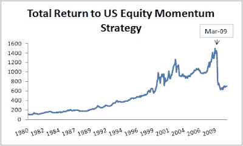

<!--yml
category: 未分类
date: 2024-05-12 21:14:43
-->

# Falkenblog: Momentum Still Lagging

> 来源：[http://falkenblog.blogspot.com/2010/12/momentum-still-lagging.html#0001-01-01](http://falkenblog.blogspot.com/2010/12/momentum-still-lagging.html#0001-01-01)

The graph shows the total return to a strategy long positive momentum stocks, short negative momentum stocks (it's from Kenneth French's

[excellent data repository](http://mba.tuck.dartmouth.edu/pages/faculty/ken.french/Data_Library/det_mom_factor.html)

). Historically, stocks that have outperformed over the past 3-18 months tend to outperform over the next 3-18 months, with an optimal point being around 12 months. The above graph is the total return for going long the past winners, short the losers. Historically this strategy has generated a puzzle, because the annualized return of around 8% it is pretty high, and it seems independent of the standard value and growth risk proxies. Sometimes it is added as a risk factor to studies, but mainly because we know it works and don't want to confuse this finding as something else. There is not a good 'risk' explanation for it.

Anyway, it seemed like easy money until March 2009, when it got clobbered, just as many prophets of doom were on CNBC telling Maria Bartiromo another leg down was in the cards. Actually,

[they would say](http://www.youtube.com/watch?v=Lqf9VK3vFdk&playnext=1&list=PL55456B79D209A6B4&index=6)

another big decline 'could' happen (thus if it happened they would take credit for predicting the decline, and if it didn't they would note all they said was 'could'--predicting is so easy on TV once you know these tricks!).

Of course that was basically the start of the US market recovery and all those stocks that had been pounded like banks roared back (the momentum portfolio would have been short those). From March 2009 through September 2009 the momentum strategy lost about 50% and has gone up only about 5% since. Since 1932 (when it lost 77%), its worst draw-down was consistently about 30%, so the standard financial fat tail event happened. If you are lucky when such strategies stop working they flat-line, but this one was not so fortunate. As they say about these statistical patterns: they work until they don't.

A lot of funds were adopting momentum previous to this, especially because it came out the tumultuous 2007-8 period relatively unscathed. Unless momentum starts to really outperform it will go the way of 'low price' stock funds, because a big -50% really hurts all those lifetime annual return statistics.

I remember back in 2003 I convinced my boss to try momentum because it seemed have positive alpha. So, we put it on in the fourth quarter, and it started out ok, so ramped up in December. Of course, December 2003 was really bad for this strategy. Without a long track record, I looked like an idiot. I felt horrible and remember writing Ken French an email, and asking, what can I tell my boss about momentum's lousing December 2003? He was nice enough to reply, though all he said was, 'tell him there's risk'. Alas, that was not a good answer. In real time when you lose money it isn't seen as risk that pulled a bad number from the urn of chance, but a bone-headed mistake, especially when you don't have a benchmark. That wasn't one of my better Christmases.