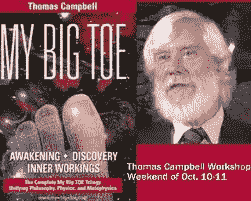

<!--yml
category: 未分类
date: 2024-05-12 20:03:52
-->

# Falkenblog: My Big Toe

> 来源：[http://falkenblog.blogspot.com/2013/07/my-big-toe.html#0001-01-01](http://falkenblog.blogspot.com/2013/07/my-big-toe.html#0001-01-01)

A large problem in physics concerns the nature of quantum reality, where as Richard Feynman famously  said, “if you think you understand it, you don’t understand it.”  A currently popular solution is the many worlds hypothesis, preferred by

[Eliezer Yudkowsky](http://lesswrong.com/lw/q8/many_worlds_one_best_guess/)

among others, which is that for every quantum event, everything actually happens, merely in different branching universes. 

Another solution is offered by physicist 

[Tom Campbell](https://www.my-big-toe.com/)

, author of

**My Big TOE**

(Theory of Everything), who argues that we are in one of

[Nick Bostrom’simulations](http://www.simulation-argument.com/)

, autonomous ems or avatars in a multiplayer game.  Campbell argues the collapse of the wave-function is only necessary when an observer is watching, in the same way a field in World of Warcraft is not rendered to anyone until a player wanders over to it.  He goes on to argue the essence of our world is consciousness, which makes reality arise the same way walking around

*The Matrix*

creates the pixels showing a specific landscape.  This  implies there’s no sound of a tree if there’s no consciousness to hear it, among other things.  

Yet, things like sounds have effects via their acoustic reverberations on many unconscious things like plants and rocks, and these effects need to be incorporated into the environment.  Things that don’t affect a consciousness still have real effects that we see later, and if the world is simulated precisely because it’s too complicated to calculate the emergent property ex ante, then one needs to run the simulation for these effects all the time anyway, not just when a conscious agent looks.  Consciousness seems like an arbitrary way to dictate the nature of what actually happens in a simulation, as if the simulators are monitoring conscious agents and their peripherals, which seems implausible. 

As an economist, I like idea that everyone has to economize, in that no one is too rich to ignore time constraints or the size of one's stomach; this is why economics is at some level universal: trying to maximize an objective function given constraints is something everything has to deal with.  Similarly, an ethereal designer would also have resource constraints, because if they had infinite resources, they wouldn't be playing games, they’d be trying to figure out how to kill themselves because it would be painfully boring to exist after a google years.  Any finite computer system doesn't have memory  for the infinite number of simulated universes created at every quantum resolution as implied by the many worlds hypothesis.

My dog might think I'm god, giving him food from sources he can't understand.  Avatars in a sim might consider their programmers gods.  In both cases, these gods are not omnipotent nor omniscient, exactly why they appreciate their creations. Even if god were as in the Bible, I can't imagine he's truly omnipotent because in such cases he would have no reason to create the Earth or people, because he would know what would happen--he could figure everything out-- making the exercise uninteresting, uninformative, pointless.

So, assuming we are the instantiation of a simulation designed by hyper intelligent beings in the 10

^(th)

dimension, they almost surely have resource constraints; they can’t allow the simulation's usage of memory to explode over time.   We don’t know the purpose of this game, but there are rules that we see as the laws of physics, including their physical rule that the simulation not require an infinite amount of memory. 

This nicely explains why they chose to have wave-particle duality.  So many things interact over time that keeping track of all those point objects would require a great deal of information, indeed,  the information needed if we didn't have wave-particle duality would overtax our simulators.  Luckily, the interaction of wave functions for these particles greatly compresses the amount of information needed to

*precisely*

capture their interaction.  That is, the wave function does not merely approximate these particles, it completely captures their interaction.  The set of all possible wave functions at any given time forms a vector space, which means that it is possible to add different waves like how you can combine Gaussian distributions into a single Gaussian distribution and ignore all the ones that came before.  When there are many particles there is only one wave function, not a separate wave function for each particle.

This is probably one of many reasons our god-like programmers chose this for an aspect of their simulation, our reality. For example, as we move forward it time, having electrons exist as a constant probability mass as opposed to moving about is both consistent with all its potential interactions and uses a lot less memory.  

The bottom line is,

*if we are in a simulation*

, there needs to be compressive sampling because quantum effects between particles would otherwise require an infinite amount of memory, so the

[meaning of the wave function](http://en.wikipedia.org/wiki/Copenhagen_interpretation#Meaning_of_the_wave_function)

is that it's for data compression.  Particles don't care if conscious entities are watching or not, the compression is built into nature as a way to save on electricity, as opposed to caring about whether clever scientists are watching or not.  The fortuitous data compression implicit in wave functions is merely another reason to suspect we are in a simulation. If we are in a simulation, it's interesting to think why this is amusing or informative to a really smart being.

I would like to tell our designers that I’m on to them, and will refrain from further elaboration upon increases in Strength, Wisdom, and Charisma.