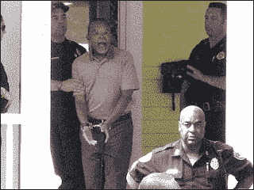

<!--yml
category: 未分类
date: 2024-05-12 21:53:46
-->

# Falkenblog: My Police Encounter

> 来源：[http://falkenblog.blogspot.com/2009/07/my-police-encounter.html#0001-01-01](http://falkenblog.blogspot.com/2009/07/my-police-encounter.html#0001-01-01)

James Taranto

[notes](http://online.wsj.com/article/SB10001424052970203946904574302304074459422.html)

the latest kerfluffle about Henry Louis Gates getting arrested for Breaking and Entering, as a neigbor saw him breaking into his own house (the door was jammed). The Boston Globe

[notes](http://www.boston.com/news/local/breaking_news/2009/07/harvard.html)

the following thoughts from Gates's Harvard colleague:

> “He and I both raised the question of if he had been a white professor, whether this kind of thing would have happened to him, that they arrested him without any corroborating evidence,” said S. Allen Counter, a Harvard Medical School professor who spoke with Gates about the incident Friday. “I am deeply concerned about the way he was treated, and called him to express my deepest sadness and sympathy.”
> 
> Counter, who had called Gates from the Nobel Institute in Sweden, where Counter is on sabbatical, said that Gates was “shaken” and “horrified” by his arrest.

Deeply concerned? Shaken? Horrified? Look at the picture above (

[taken from the Wash Post](http://www.washingtonpost.com/wp-dyn/content/article/2009/07/21/AR2009072101771.html?nav=hcmodule)

), and you can imagine the scene (love the look on the black cop's face, the hand raised, the open mouth on Gates saying you have "no idea who [you're] was messing with!"). He has an

[interview](http://www.theroot.com/views/skip-gates-speaks)

on The Root talking about his 'terrible and humiliating' experience.

I remember having blown a bike tire in grad school I walked my bike tire to the bike shop across campus. I was an instructor at Northwestern at the time, and there were many bikes around campus and nearby, along with many bicycle thiefs (alas, my best bike ever was stolen there). Now, holding merely a bike tire looks suspicious because many bikes are locked up in a way that you can easily remove the tire. Anyway, cops saw me, and gave me the run-down: where was I going? where did I get the bike tire? where did I live? Where did I work? They called in all this information, and it took about 15 minutes to verify I was an instructor at the University. Finally I was allow on my merry way. There was no apology received, or asked. They weren't mean, but they weren't very nice either.

I've had several such run ins. I figure many cops are jerks because it appeals to people who like to boss others around. But it's an essential job, and if we had a bunch of sociologists or peace activists on the police force there would be anarchy, which only helps non-uniformed oppressors.

As someone who had liberal parents growing up in Southern California, I have never been racist, so I have no racial guilt. I think everyone should be treated the same, which is why I find these cases so repellent. Obama is not making these incidents go away, just as electing black mayors did not reduce the claims of racism in the cities where this occurred. I suspect many whites thought that by electing a black president, perhaps black/white relations in America will turn the corner, as the black community would see this as evidence that the white majority is not racist and assimilate like the Germans, Irish and Italians. I was born around a year after the Civil Rights Act was signed and my parents remember driving through the 1965 Watts riots to the hospital. As a child my parents were rather optimistic as if black/white would be like Lutheran/Methodist, a distinction without any resonance today. But things aren't getting better in general, and I'm not optimistic.