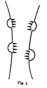

<!--yml
category: 未分类
date: 2024-05-12 21:05:08
-->

# Falkenblog: N.R. Hanson's Theory Ladenness

> 来源：[http://falkenblog.blogspot.com/2011/03/nr-hansons-theory-ladenness.html#0001-01-01](http://falkenblog.blogspot.com/2011/03/nr-hansons-theory-ladenness.html#0001-01-01)

I remember being really impressed by Popper's writings on falsification, but over time I think it's much more of a goal than a description of science. Feyerabend did a good job of highlighting that in practice there's no demarcation between observation and theory. This is because no theory is consistent with all the facts. Indeed, many theories are built on explaining facts that are not true! Further, higher truths, aka fundamental theories, are rarely rejected as a practical matter. Contrary datapoints are seen as meaningless anomalies, anecdotes, while consistent observations are 'data,' aka, truth.

Recently I read N. R. Hanson's

[Patterns of Discovery](http://evans-experientialism.freewebspace.com/hanson.htm)

, written in 1958, and realized that Hanson really made this point clear prior to Feyerabend.

Note the picture to the right of a bear climbing a tree. Once you have that theory in your mind, you see it instantly, but without that information, you could easily see some bugs climbing strings. This is an example of an observation being 'theory-laden'. Observations are shaped by prior knowledge. People see different things because a theory is a lens and a blinder; data is ambiguous.

I find it really fun to see where a good idea like theory-ladenness comes from, and like to find the original sources. One could say Feyerabend is derivative of Hanson, who was derivative of Wittgenstein, who got his idea from the Duhem–Quine thesis. But, the origins of a theory is usually a pointless endeavor. The bottom line is that facts are generally derivative of theory, contrary to the view that theories are deduced from facts.

Hanson sounds like a really interesting guy. He played trumpet at Carnegie Hall, was a fighter pilot in WW2 (famously looping the Golden Gate Bridge), designed the unit's logo, was a boxer, and died at 42 in a plane crash with ten books in progress, including a history of aerodynamic theory.