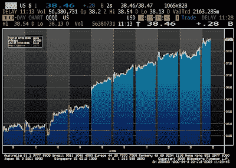
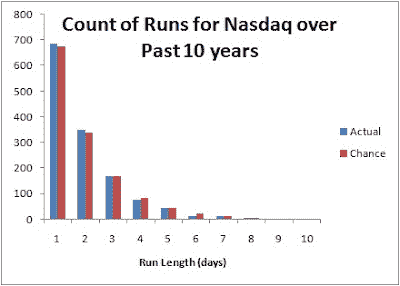

<!--yml
category: 未分类
date: 2024-05-12 21:53:30
-->

# Falkenblog: NASDAQ Up 10 Days in A Row

> 来源：[http://falkenblog.blogspot.com/2009/07/nasdaq-up-10-days-in-row.html#0001-01-01](http://falkenblog.blogspot.com/2009/07/nasdaq-up-10-days-in-row.html#0001-01-01)

Shocking? Not really. If we assume a 50-50 chance of rising, we should expect this to occur once every ten years, and it did not happen in the prior ten. Below is the actual frequency of 'runs' (consecutive trending), compared to the 50-50 theoretical (actual markets go up 52% of days, but that's not material here).

