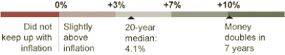
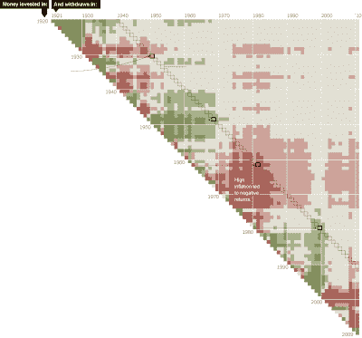

<!--yml
category: 未分类
date: 2024-05-12 21:12:16
-->

# Falkenblog: NYT Pixel Chart

> 来源：[http://falkenblog.blogspot.com/2011/01/nyt-pixel-chart.html#0001-01-01](http://falkenblog.blogspot.com/2011/01/nyt-pixel-chart.html#0001-01-01)

The Sunday NYT has a neat

[pixel chart](http://www.nytimes.com/interactive/2011/01/02/business/20110102-metrics-graphic.html?scp=1&sq=investing%20when%20you%20start%20when%20you%20finish&st=cse)

, where the blocks are years from 1920 to 2010\. Each cross-tab represents the return from the vertical axis to the horizontal, so dots near the diagonal are short-term investments, those towards the right, buy-and-hold.

What it says to me is that the long run is easier to predict than the short run in this sample. Jeremy Siegel

[suggests](http://efinance.org.cn/cn/fm/The%20Equity%20Premium%20Stock%20and%20Bond%20Returns%20since%201802.pdf)

these are invariant parameters, yet as Lubos Pastor and Robert Stambaugh point out in their

[Are Stocks Really Less Volatile in the Long Run?](http://papers.ssrn.com/sol3/papers.cfm?abstract_id=1136847)

, we have to remember there are only a handful of '20-year' independent samples here, hardly enough to say these are population means. Further, data from the 19th century was often filled with selection biases (see

[here](http://halshs.archives-ouvertes.fr/docs/00/46/82/09/PDF/wp200821-2.pdf)

), which makes sense when you consider who has the incentive to derive these indices (those selling equities).