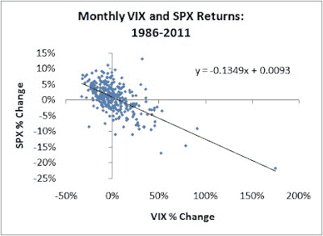

<!--yml
category: 未分类
date: 2024-05-12 20:51:19
-->

# Falkenblog: Negative SPX/VIX Correlation and Fu Result

> 来源：[http://falkenblog.blogspot.com/2011/06/negative-spxvix-correlation-and-fu.html#0001-01-01](http://falkenblog.blogspot.com/2011/06/negative-spxvix-correlation-and-fu.html#0001-01-01)

Above is a chart of the monthly percent change for the

[VIX](http://en.wikipedia.org/wiki/VIX)

, an index approximately equal to the option volatility on the S&P500, and the return on the S&P500 itself. There's a clear negative pattern. This makes sense, and volatility increases when the market is falling and vice versa. If I told you the VIX, or its ETF the

[VXX](http://finance.yahoo.com/q?s=VXX)

, was up big, there's a strong chance the SPY was down big.

Move the date forward, however, so it's past volatility change and future return, and there's no correlation, and there's a slight negative correlation between volatility levels and stock returns. So, it seems mainly a contemporaneous pattern applied to changes in volatility, spilled milk as opposed to a predictor. Think about when volatility was rising in 2008, and prices were falling simultaneously. The rise in volatility was not predicting price moves, just reflecting them, and the high volatility correlated with both the big move down and the big rebound in the latter part of 2009\.

Fangjian Fu has a well-cited paper in the 2009 JFE,

[Idiosyncratic Risk and the Cross-Section of Expected Stock Returns](http://papers.ssrn.com/sol3/papers.cfm?abstract_id=676828)

, that purports to show that contrary to earlier reports that idiosyncratic volatility and future returns are negatively correlated, they are actually positively related. He states that if you estimate idiosyncratic volatility using an EGARCH model, you reverse the results of

[Ang et al](http://papers.ssrn.com/sol3/papers.cfm?abstract_id=611363)

, and find a positive 1.75% return each month for the highest minus lowest idiosyncratic volatility deciles, which is basically flat except for a big jump upward in the highest expected volatility decile.

I've looked at this enough to believe he's made a mistake, but I don't know what, exactly. I don't see this in the data, and I doubt his specific EGARCH would change that, but it's difficult to recreate his methodology exactly. I presume it is in some sort of selection bias in his sample. He states that 'stocks with high idiosyncratic volatilities are contemporaneous with high returns, which tend to reverse in the following month. As a result, the returns of high-IVOL stocks are abnormally low in the next month', a finding I find bizarre because it's contrary to the pattern above, which hold not just for indices but stocks as well.

But, this is good news for low volatility traders. As long as the old guard can point to proof that their result is still viable, they will believe it, and that leaves more opportunity for those who see through this. To paraphrase

[Cicero](http://www.brainyquote.com/quotes/quotes/m/marcustull139337.html)

, the function of wisdom is to discriminate between good and bad investments.