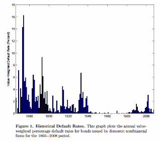

<!--yml
category: 未分类
date: 2024-05-12 21:21:27
-->

# Falkenblog: Never Enough Data

> 来源：[http://falkenblog.blogspot.com/2010/09/never-enough-data.html#0001-01-01](http://falkenblog.blogspot.com/2010/09/never-enough-data.html#0001-01-01)

One problem you discover very quickly in macro is there isn't enough data to distinguish between many competiing theories. 100 years is a long time, but really not that many business cycles. The problem also pertains to bond default rates. Many people look at bonds, and because the bond has a 1000 issuers over 10 years, it seems to have 10000 observations, a pretty large sample. But if that time period contained only one recession, that's really not a large sample.

Macroeconomic cycles have peculiar sectoral shocks every recession (part of my

[Batesian Mimicry explanation](http://falkenblog.blogspot.com/2010/07/batesian-mimicry-explanation-of.html)

of business cycles). The past have been, in reverse order: housing, tech, commercial real estate, and energy. Notice a pattern? The pattern is they are all different! So, if your 1000 issuers weren't in the bad sector, you can easily gain a false sense of security.

The above is from a paper by Giesecke, Longstaff, Schaefer and Stebulaev,

[Corporate Bond Default Risk: a 150-Year Perspective](http://www.stanford.edu/dept/MSandE/cgi-bin/people/faculty/giesecke/pdfs/glss.pdf)

. Unlike Rienhart and Rogoff's

[This Time It's Different](http://falkenblog.blogspot.com/2010/04/reinhart-and-rogoff.html)

, these guys actually looked not only at the number of defaults, but made a stab at their 'rates'. That is, R&R's results are intriguing but given they only mention the number of defaults, it's not obvious if this is large or small because you don't know how many countries were issuing. Facts are very important in economics and finance, because so many important issues like the equity premium and default rates have such large uncertainty. Most people think facts are easy, and theory is hard, but actually I think it is the reverse. Theory, once you understand it, is trivial, yet important facts are very elusive, often at the bottom of most major disagreements.

It appears that default rates were much higher in the 19th century, and this could be very relevant to the 21st, because so many countries, and government entities within countries, have been on an unsustainable Greek-like binge. A subsequent wave of sovereign defaults could seem 'unprecedented', but only if you counted your lifetime as the sample of inference. As Faulbert noted about human folly, 'Our ignorance of history makes us libel our own times. People have always been like this.'