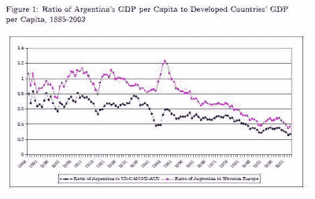

<!--yml
category: 未分类
date: 2024-05-12 20:55:17
-->

# Falkenblog: New Econ Data Sites

> 来源：[http://falkenblog.blogspot.com/2011/05/new-econ-data-sites.html#0001-01-01](http://falkenblog.blogspot.com/2011/05/new-econ-data-sites.html#0001-01-01)

I don't know why, but in the past week two new websites were introduced to me that consolidate economic data:

[Junar](http://www.junar.com/portal/HomeManager/actionQuery)

and

[Zanran](http://www.zanran.com/q/)

. Junar is more into charts and exportable data, while Zanran has more pdfs with academic papers on the relevant topics.

So, for example, I pulled up this on Argentina, which is an interesting case study in Keynesian policies. From 1890 to 1939, the country's per capita income was similar to that of France, Germany and Canada, but then President Juan Perón took over and instituted a suite of progressive reforms: increased unionization, nationalization of major industries, more generous social welfare, increased public works investments, high tariffs and import restrictions. The big idea then was called

[developmentism](http://en.wikipedia.org/wiki/Developmentalism)

, which is a national-socialist-fascist model that attempts to ameliorate the deficiencies of 'the market'. The result you can see below, as their income relative to other countries steadily declined from about 1946 onward (the center of the graph is 1946ish).

