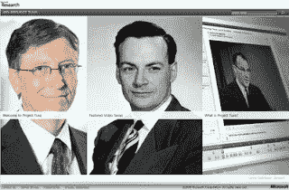

<!--yml
category: 未分类
date: 2024-05-12 21:54:08
-->

# Falkenblog: New Feynman Lectures Online

> 来源：[http://falkenblog.blogspot.com/2009/07/new-feynman-lectures-online.html#0001-01-01](http://falkenblog.blogspot.com/2009/07/new-feynman-lectures-online.html#0001-01-01)

Office 2007 is an abomination, with defaults in every app seemingly all set to 'Annoy Eric'. But here's Bill Gates doing good work. He put a

[bunch of Feynman videos](http://research.microsoft.com/apps/tools/tuva/)

online from 1964\. Thanks Bill. You need to watch this using IE (of course).