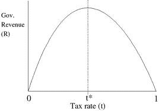

<!--yml
category: 未分类
date: 2024-05-12 21:19:11
-->

# Falkenblog: No Nobel for Art Laffer, Ever

> 来源：[http://falkenblog.blogspot.com/2010/10/no-nobel-for-art-laffer.html#0001-01-01](http://falkenblog.blogspot.com/2010/10/no-nobel-for-art-laffer.html#0001-01-01)

A good way to think about the state of economics, is to note the disparity between the treatment of the

[Laffer curve](http://en.wikipedia.org/wiki/Laffer_curve)

and Nobel prize winning economics.

In this year's Nobel highlighted work that formalized the effects of search on labor dynamics. Basically, if you have people with unknown productivity searching for jobs, they should not take the first job offered; firms should fire those people with below-average productivity. That's a good insight. Too often people look at the unemployed as a homogeneous lot, who are affected by labor demand like plankton affected by the tides.

Yet as a formal model, it is ambiguous, as all formal economic models are. First-order and second order effects offset each other, making their relevance an empirical matter. Thus, wage subsidies, minimum wages, laws making it difficult to fire employees, have ambiguous effects on society. Mortensen's

[1970 model](http://ideas.repec.org/a/aea/aecrev/v60y1970i5p847-62.html)

did not make it any easier to answer these questions, which is why societies are not any clearer on how to best alleviate unemployment today as they were in 1975\. He just noted unemployment is rational for someone waiting for a good job. Again, a good idea.

Art Laffer famously presented his idea that tax revenues are at first increasing, then decreasing in tax rates, on a cocktail napkin, when arguing about the president Gerald Ford's tax increase (ie, 1974). This too is a good idea. This too, is an empirical issue, as we can be either at a point where revenue is increasing in the marginal rate, or decreasing. Even if the curve is increasing, its slope is important, especially because maximizing government revenue is not the same as maximizing societal welfare.

Yet Art Laffer will never win the Nobel prize. His idea is as insightful and has the same empirical limitations as the modeling of labor search on unemployment or any of the other economics Nobels. If you think Laffer's point is too uncertain to be Nobel-worthy, you are putting to much confidence in the Nobel brand (they are

all

that uncertain); if you think Laffer's point is not sufficiently rigorous, I think you are confusing rigor with understanding.

Nobel prize winning work has the imprimatur of 'science' because it spawns elegant models. The models are no more predictive or instructive than the Laffer curve, just they lend themselves to infinite amounts of rigor so it can then it looks like physics, which is the end game (

looking

like physics). Rewarding formalism that is no more precise than a Laffer curve has been really bad for understanding economic systems. The Laffer curve is marginalized by economists for its unpretentious honesty, whereas the dynamic general equilibrium search models are more misleading as to how precise they are or can be. This makes economics less fruitful.