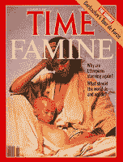

<!--yml
category: 未分类
date: 2024-05-12 23:07:43
-->

# Falkenblog: Not Sustainable

> 来源：[http://falkenblog.blogspot.com/2008/07/not-sustainable.html#0001-01-01](http://falkenblog.blogspot.com/2008/07/not-sustainable.html#0001-01-01)

In the

[Irish Potato famine](http://www.victorianweb.org/history/famine.html)

of 1845-8, many people starved to death. The census in Ireland showed a population of 6.5 million in 1851, down from 8.2 million in 1841.

In contrast, 1984 - 1985

[famine](http://countrystudies.us/ethiopia/43.htm)

in Ethiopia was the cause for the single "Do They Know it's Christmas", and much international concern. But population growth clipped along at a 2.8 percent for the the 1980-1985 period, greater than it was in the 1970's. It's now over 3%. And there's always

[talk](http://news.bbc.co.uk/2/hi/africa/2440093.stm)

about some new famine in Ethiopia (the magazine cover above is from 2000).

Poverty relief is based on the idea that you give someone something, they will pull themselves out of their current circumstances and become self-reliant. Instead, it appears it just increases the numbers of those who can't support themselves.

[Rephrasing Bagehot](http://findarticles.com/p/articles/mi_m1571/is_44_16/ai_72274824/pg_1)

, one of the most melancholy of human reflections is that charity does more harm than good.