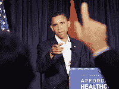

<!--yml
category: 未分类
date: 2024-05-12 23:15:35
-->

# Falkenblog: Obama Tax Hike

> 来源：[http://falkenblog.blogspot.com/2008/06/obama-tax-hike.html#0001-01-01](http://falkenblog.blogspot.com/2008/06/obama-tax-hike.html#0001-01-01)

The main reason I vote Republican is because I think that in general, over time, they will spend less than Democrats. Clearly, Bush's Medicare, Iraq War, and No Child Left Behind, are good data points against this thought, but other than the Iraq War (big exception, to be sure), the Democrats want to spend more, not less. This nation needs more taxes like my kids need more candy.

Thus, when a candidate says he is going to raise taxes, given the natural incentives of the system, this means the sky's the limit, and spending will fill the gap like nature abhors a vacuum. And so Obama saying he is going to raise taxes right out of the shoot, I figure, this could be big trouble. Voters tend to sense this, as famously, when Walter Mondale made his acceptance speech at the 1984 Democratic Convention, Mondale said: "By the end of my first term, I will reduce the Reagan budget deficit by two-thirds. Let's tell the truth. It must be done, it must be done. Mr. Reagan will raise taxes, and so will I. He won't tell you. I just did." While this was meant to show that Mondale would be honest with voters, it was largely interpreted as a campaign pledge to raise taxes, and Reagan destroyed Mondale in the fall election.

Conservatives have argued Obama is going to raise taxes, and Obama's defense?

[Not as much as you say](http://online.wsj.com/article/SB121313198741161919.html?mod=hps_us_whats_news)

, and more progressively. He would raise the 15% capital-gains tax on the income from sales of investments to about 20%. "my discussions with people like Warren Buffett indicate that it will probably not have any significant impact in terms of investment." As Buffett is 78, and has tens of billions of dollars, he could live insanely lavishly until he dies under the most insane tax regime, so I don't think his preferences are so relevant.

The Illinois senator said he would cut income taxes for 95% of American workers, meaning marginal tax rates will rise considerable on bigger earners. Progressive taxation is desirable to many people, as it would probably win a vote in the same way expropriating the wealthy always seems like a good idea when demagoguing. Whenever you rob Peter to pay Paul, you can always count on Paul’s support. The problem is that the more progressive the tax rate is, the more it skews investment decisions, leading to a missallocation of resources. I was at a presentation by Northern Trust, and the audience were investment advisers to the wealthy. Most were lawyers and tax specialists, as opposed to people who really knew investments. This makes sense because if you make a lot of money, taking advantage of the various tax breaks is the most important priority. It shouldn't be this way, you want investors thinking about whether to buy subprime, or get out, not whether the current tax break on ethanol, or muni bonds, will continue.

Obama says his

[plan](http://www.boston.com/news/nation/articles/2007/10/28/obama_proposes_increasing_social_security_tax_on_wealthy/)

to shore up Social Security by raising the level of taxable wages wouldn't affect 97% of taxpayers. Currently this rate is about 7.6%. Currently this tax stops at $97,000 per year, because presumably its not a tax, but an investment in a retirement fund. As outlays are capped, taxes above this can no longer be called an investment, but are laid bare as the taxes they are. Thus, if Obama installs this tax for income above $200k as he plans, this will merely highlight that social security taxes are not an investment, but a tax. That's a 7% marginal tax increase on the wealthy, more money down the DC rat hole.