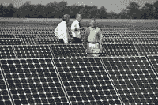

<!--yml
category: 未分类
date: 2024-05-12 21:45:02
-->

# Falkenblog: Obama's Alpha Delusion

> 来源：[http://falkenblog.blogspot.com/2009/10/obamas-alpha-delusion.html#0001-01-01](http://falkenblog.blogspot.com/2009/10/obamas-alpha-delusion.html#0001-01-01)

From the

[WSJ](http://online.wsj.com/article/SB125663945180609871.html)

:

> The Obama administration launched a clean-energy blitz Tuesday, with President Barack Obama sweeping into this Central Florida hamlet to unveil $3.4 billion in stimulus grants for advanced electricity-grid projects

This PR parade relies on the idea that this administration, if not Obama himself, gets into details, and chooses the right cutting edge technologies and methods. Look at Obama above, with his sleeves rolled up, giving pointers to an appreciative bunch of field managers (perhaps the

[NEA](http://www.foxnews.com/politics/2009/09/10/nea-communications-director-keeps-post-amid-controversy/)

can get to work on some

[Soviet Realism](http://en.wikipedia.org/wiki/Socialist_realism)

in this context). In this case, Obama merely has to allocate some of our money to a select list of projects that are aligned with the buzzwords 'clean energy', and we get the increasing returns to scale that Paul Krugman won

[his Nobel Prize](http://falkenblog.blogspot.com/2008/12/krugmans-nobel-lecture.html)

for (too bad

[Ann Krueger](http://www.law.wisc.edu/gls/documents/trade_recommended.pdf)

didn't win a Nobel for showing the same 'infant industry' argument has been a pretext to protect inefficient industries for over 200 years).

It never occured to any of these guys that there aren't any magic solutions to our energy problem. They act as if we only tried to develop batteries, we could have ten times the power. See

[this video](http://zocalopublicsquare.org/full_video_2009.php?pages=2&event_id=331)

from Zocalo, and at the end of the critical discussion about the oil industry an audience member earnestly asks: "can't we develop energy out of water?" as if the only reason we use oil is because the

[Rich Uncle Pennybags](http://www.toonopedia.com/pennybag.htm)

character from the Monopoly Game is not letting us do anything else. The electric car predates the internal combustion engine. My laptop and cell phone routinely run out of energy, highlighting the high reward waiting for the next battery innovation. There has been and continues to be research, and incentives, to increase the efficiencies of batteries.

Obama hates being compared to socialists, so I'll refrain and compare him to a communist. In the state published hagiography,

[Divine Stories About the Dear Leader](http://www.nationalreview.com/comment/triplett200403150900.asp)

, Kim Jong-Il is presented as someone excellent at golf, pistol shooting, technology, and battlefield courage. He's basically better than everyone at everything. For a communist state that belief is necessary, otherwise their system is too centralized.

Obama and his experts are presumably more efficient than the market at allocating more resources to productive technologies. The idea that since the market won't provide funds, perhaps the informed expected return on battery investment is truly low, seems absurd: how could selfish oafs who run business know better than an articulate, caring, public servant? It's

[The Secret](http://www.amazon.com/Secret-Rhonda-Byrne/dp/1582701709)

writ large: think it true, and it becomes so. No wonder it's a popular idea:

[would that it were true](http://forum.wordreference.com/showthread.php?t=129744)

.

Unfortunately, the

bien pensants

who adore Obama (or really, adore that they adore Obama), see his value add being multifaceted micromanagement. There are countless $3.4B special investment targets to do, each one with dreams of cold-fusion, high-speed trains, and the end to the achievement gap. Most people think that 'good smart people' are better in almost every way than your average businessman, and most people think they vote for such people, thus these politicians should be directing activities the way a coach directs a football team.

Alas, the value of extreme intelligence and knowledge of detail, does not scale at the managerial level. It runs out of benefit to a ruler, because they cannot and should not try to micromanage things. Thus, the best developer of a new technology is often a lousy director for a state or large corporation, and the best managers are often not the best developers. Indeed, a key advantage of those who are smart—but not too smart—is they

know

they don't know more than everyone. The Barak Obamas and Paul Krugmans, having excelled at Harvard or MIT, can more easily think they actually know more than everyone else, leading to the classic

[Fatal Conceit](http://www.nytimes.com/2009/10/27/opinion/27brooks.html?_r=1)

of planners everywhere.

The idea that the only feasible alpha for a leader of a large collective, is to enforce rules and get out of the way, is simply preposterous for those who think the Invisible Hand is merely a theory used by conservatives to excuse their indifference. This reflects a failure to appreciate the complex, homeostatic mechanisms of self interested agents within a free market, and the infinite number of ways top-down rules are worked around when applied to the masses. As Hayek noted, the biggest flaw with the free market is that it wasn't designed, it emerged spontaneously, which causes people to dismiss its value. Thus, they have 1000 page plans like our health care bill, or ideas about new committees that will assess issues intelligently and disinterestedly.