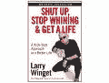

<!--yml
category: 未分类
date: 2024-05-12 23:10:52
-->

# Falkenblog: One Cheer for Whining

> 来源：[http://falkenblog.blogspot.com/2008/07/one-cheer-for-whining.html#0001-01-01](http://falkenblog.blogspot.com/2008/07/one-cheer-for-whining.html#0001-01-01)

As a parent of small children, I can say that whining is something every parent loathes. Every constraint on the child, be it a parental command, a perceived privilege granted to a sibling, or frustration with not getting things to work as they want, can generate tears and screaming. As a parent, 'no whining' is a constant refrain. I was in the local Staples, and saw they had a book,

[Shut Up, Stop Whining & Get a Life!](http://www.amazon.com/Shut-Stop-Whining-Get-Life/dp/0471654655)

It was a good read while I was waiting for the geniuses there to create a document for me. You see, no one likes whiners, and it's just self defeating. True that.

But just as poison can be a tonic in small doses (

[hormesis](http://www.independentscientist.com/)

), so too for some whining. Kids are the biggest whiners, but they are also the biggest learners. Its only because they get so excited and upset that they are sufficiently motivated to figure stuff out. A baby that doesn't cry, or an 8-year old that smiles when he strikes out or gets fewer cookies than his brother, is insufficiently whiny. We are motivated to relieve frustration, and whining is a symptom of this angst, but these episodes are often very insightful. A life with merely the

[Unbearable Lightness of Being](http://www.imdb.com/title/tt0096332/)

, or the

[Eternal Sunshine of a Spotless Mind](http://en.wikipedia.org/wiki/Eternal_Sunshine_of_the_Spotless_Mind)

, are fantasies because they imply an indifferent life, which would be both ignorant and ineffective. We all have to learn how to deal with constraints so that we both move on, but also address problems most efficiently, and you can't avoid frustration and a little inevitable whining. Like anything, it's a balance.

Aristotle noted

> Anybody can become angry—that is easy; but to be angry with the right person, and it the right degree, and at the right time, and for the right purpose, and in the right way—that is not within everybody’s power and is not easy.

Whining, and the frustration and sense of justice that motivates it, is like anger. The popularity of the book

Shut Up, Stop Whining

is probably because most of us are sick of today's cult of victimization, which celebrates pathetic people who have been wronged, clearly too far in the whiny direction--solve your own damn problems! But in the right situation, in the right amounts, it is wise, and very few people figure this out--it takes a great deal of discipline and intelligence.

There's a story about the French Reign of Terror, where the aristocrats generally went quietly to their executions. But at one point a woman who went up there screamed for her life, acting very 'beneath her station'. Seeing this, the crowd suddenly lost its appetite for executions, because they were no longer some abstract extermination, but real people who were being killed. It is among the bravest of things to face death with equanimity, but in this case some hysterics saved lives.

My kids generally whine for no good reason. But I appreciate their frustration, and try to channel it, hoping they learn when something is spilled milk, an opportunity, or a learning lesson.