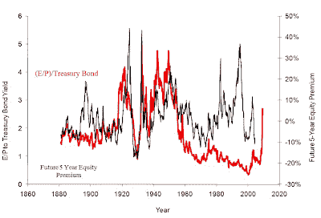

<!--yml
category: 未分类
date: 2024-05-12 21:58:34
-->

# Falkenblog: P/Es and the Stock Market

> 来源：[http://falkenblog.blogspot.com/2009/06/pes-and-stock-market.html#0001-01-01](http://falkenblog.blogspot.com/2009/06/pes-and-stock-market.html#0001-01-01)

Hindsight is a very powerful bias. For large, infrequent events like the recent financial crisis, it is difficult for many, if not most people, to see this as anything but terribly inefficient, and most of all, predictable. Maybe not right away, but over the long run.

I disagree. As

[I've mentioned](http://falkenblog.blogspot.com/2008/09/shiller-called-housing-bubble.html)

, even Robert Shiller's 2005 updated edition to Irrational Exuberance contained a very cautious look about housing. He noted it rose a lot recently, and such a rise was improbable going forward. But he did not say an aggregate price decline was likely or even significantly probable.

In that vein, the price-earnings ratio is a good example of a metric that seems very useful, but in practice not. Robert Shiller keeps historical data for the US back to 1871 on his

[website](http://www.econ.yale.edu/~shiller/data.htm)

. You can see that P/E ratios vary over the cycle in what appears to be very predictable fashion.

The above graph shows the P/E ratio as well as the future 5 year equity premium, which I defined as the annualized future 5 year stock return minus the average Long Term Treasury bond yield. There's a nice negative correlation between this future return and current P/E ratios (Shiller uses the prior 10 years earnings for his denominator). One thinks, hey, this is a pretty obvious investing signal.

Yet, on a monthly level, the signal is horrible. If you look at the current P/E, and compare this to the then historical data, there's a very small relation with month-ahead returns. Given the upward drift in the stock market over time, and rule based on historal P/Es, where you choose to invest/not-invest based on, say, being in the 90th percentile of P/Es, lowers your annual return.

But, the correlation on a longer basis seems much better, and so, if you chose a rule to say, invest/not-invest every 5 years come hell-or-high-water, this surely generates a much better return? No. One way to see this is the graph below. Here I calculated the ratio of the earnings yield to the Treasury rate(earnings/price normalized by the interest rate as represented by the long term Treasury rate). One sees a very tight relation from 1920 through 1960, perhaps even to 1980, but you would have missed the bull run of the 1890's and 1980-2000\. Any rule here, over the entire century, generates no real gain.

The bottom line is that many trends that seem really good, work over long periods of time, but for only half the time. In an up-trending market, anything that tempts you to sit on the sidelines is swimming against the stream. For assets that historically have trended upward, like housing or stocks, it is never obvious when to move totally out of the position.