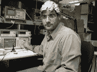

<!--yml
category: 未分类
date: 2024-05-12 22:03:59
-->

# Falkenblog: Perimeter Institute to Save Economics

> 来源：[http://falkenblog.blogspot.com/2009/05/perimeter-institute-to-save-economics.html#0001-01-01](http://falkenblog.blogspot.com/2009/05/perimeter-institute-to-save-economics.html#0001-01-01)

The

[Perimeter Institute](http://www.perimeterinstitute.ca/index.php?lang=en)

sponsored a conference on how non-economic scientists and mathematicians can address the recent economic crisis. As we all know, economists did not forecast this crisis. Non-economists, those outside the sway of convention economic dogma, saw it a mile away. Where have these models been? A clue was provided by one Eric Weinstein in a

[panel discussion](http://pirsa.org/C09006)

:

> I've more or less tried to keep a low profile the best I can, for the last 20 years, because it hasn't been a very safe environment to talk. And finally, we have in the United States at least, a President who openly calls for nonbelievers to be brought into the big tent...we are at the beginning a hopeful period perhaps...We have been through a generation of a very low intensity sort of McCarthy era were instead of the House Un-American Committee ... we have had Fox News, we've had Lee Atwater, it's been very intimidating to talk, things have changed...

The idea, I guess, is that our economy was run by some sinister cabal, and now with The Chosen One in charge, we don't have to fear jack-booted thugs that previously impeded financial reform and intellectual progresss. I guess a lot of good ideas were kept in the closet because of frequent Bush/FoxNews intellectual waterboarding.

This was at the Perimeter Institute, a Canadian group of physicists, that at this conference to create a Manhattan Project for economics. Interestingly, Nassim Taleb was

[there](http://streamer.perimeterinstitute.ca/mediasite/viewer/NoPopupRedirector.aspx?peid=72d616ce-868f-41bf-80f3-78f33c5d16a9&shouldResize=False)

, effusively praising the audience, even though he harshly criticizes scientism and excessive mathematics, the

modus operandi

of the Perimeter Institute. So if the charlatans and idiots who mistake the map for the territory do not include Andy Lo, Emmanuel Derman, Paul Wilmott, physicists doing economics, or Danny Kahneman, it's not clear what group of those doing economics he is talking about. These guys span the gamut of ways to address economics, and are hardly minority views. If these guys get a pass, I don't see who doesn't.

Taleb's schtick is merely to harshly criticize 'conventional wisdom' as practiced by those outside his listening audience, flattering his listeners that those morons don't get it like 'we' do. Though I find this very dubious reasoning, clearly his popularity as a speaker and writer suggest this is an effective rhetorical device. If you are well-known and say nice things about Taleb, he'll exempt you from his list of idiots and praise you. If you criticize the significance of what Taleb is saying, he'll call you an idiot (or, if you don't have a Nobel prize, just threaten to sue you, write your boss to get you to stop saying mean things, etc.).

Taleb mentioned some guy who said an event that should have happened once every 10 thousand years happened three days in a row. Clearly, this guy is describing a bad model, and if he really meant it, he is not very smart. I don't see how damning this is for economics, because most good economists I know recognize that financial time series have fat tails. But, when people pay $50k a speech, they expect to hear revolutionary ideas, and without straw men the ideas seem much less revolutionary. The idea that if you take a time series with fat tails, and process it with a very nonlinear function, it will be very hard to predict the outcome, is rather obvious. OLS, variance, are all meaningless. I don't get it. What is the alternative, extreme value theory? Chaos theory? For many things, you get similar results, because variance is correlated with extremum, and for many other applications the standard errors are so large and non-robust to small changes in parameters you can't use these models. On the other hand, like Winston Smith in 1984 I have been intellectually waterboarded so much, I'm incapable of seeing why this observation is so revolutionary (plus, I'm on the Haliburton payroll).