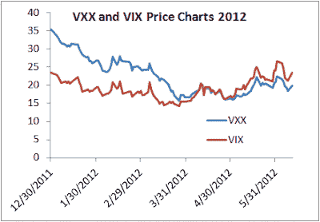

<!--yml
category: 未分类
date: 2024-05-12 20:28:03
-->

# Falkenblog: Poor Volatility Buyers

> 来源：[http://falkenblog.blogspot.com/2012/06/poor-volatility-buyers.html#0001-01-01](http://falkenblog.blogspot.com/2012/06/poor-volatility-buyers.html#0001-01-01)

The

[VXX](http://finance.yahoo.com/q?s=VXX&ql=1)

and TVIX target the VIX futures index, a metric of forward-looking volatility, and trade well over 40 million shares a day. As the VIX went up from 20 to 80 in 2008, which I guess makes a lot of people think this is a smart trade. With all the tumult this year, the VIX has remained about the same since the beginning of the year, but the VXX and TVIX are down 41% and 72%, respectively.

Since inception (Jan 2009), the VXX is down about 95%, and since Jan 2008, the SPVXSTR index (which matches the VXX pretty well) is down about 88%, so it's not like over time this strategy has a positive return. I bet a large fraction of these buyers have a copy of 

**[The Black Swan](http://falkenblog.blogspot.com/2009/03/review-of-talebs-black-swan.html)**

 on their bookshelf.  The best way to play the volatility game is not to buy it, but to avoid relatively high volatility assets.  People overpay for stuff with large positive skew, like lotteries, and volatility.

