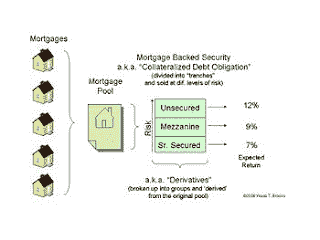
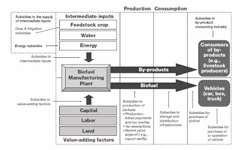

<!--yml
category: 未分类
date: 2024-05-12 22:51:05
-->

# Falkenblog: Private vs. Public Complexity

> 来源：[http://falkenblog.blogspot.com/2008/10/private-vs-public-complexity.html#0001-01-01](http://falkenblog.blogspot.com/2008/10/private-vs-public-complexity.html#0001-01-01)

Much has been made about the complexity of derivatives, especially asset backed securities, as accelerators in this financial crisis. I agree these are complex, as the derivatives involve a sequences of rules, creating a waterfall of cashflows during the life of the securities, and a sequence priority in the case of default. It is difficult to get data on the key variables needed to compute their value, which combined with the standard reporting of financial statements by banks, makes it anyone's guess whether the run on Bear was a mere liquidity event, or they were truly insolvent. In the average prospectus for a mortgage backed securities you have to carefully wade through legalese to the substantive language about how the security will evolve through time.

But as with anything, you have ask, complex compared to what? Consider the complexity of ethanol production in the US. What is the true economic viability of this approach to our energy concern? To do that, you need to know the costs of the inputs and compare them to the costs of the outputs, including the fixed costs involved in creating the capital necessary to produce and use this fuel source. There are a variety of governmental subsidies that make this exercise basically impossible. You have subsidies on corn via farm programs. You have tax breaks for ethanol producers, and those using machines that can use ethanol. You have mandates that impart an implicit subsidies, and an ethanol import tariffs that are an implicit subsidy. And you have tax breaks both for the R&D, and the capital investment into ethanol refineries. These occur at the Federal Government level via corporate tax breaks, breaks on investment in various facilities, Department of Energy and Agriculture grants, and their counterparts at the state level. How much does it cost to create a gallon of ethanol? Some even claim the increased price of corn from ethanol incentives saves money that would be spent via a competing government program, as

[one source](http://www.farmgate.uiuc.edu/archive/2008/10/ethanol_subsidi.html)

says the government actually

saved

$3.45 billion on what are called loan deficiency payments as a direct result of these ethanol subsidies. With all the subsidies, tarifs, and tax credits along the chain from farmland and inputs to the final sale at the pump, who knows?

In the private market, eventually the profitability, the market's comparison of costs to benefits, either encourage activity or squelches it. In government complexity prevents any such comparison, so that so many government programs persist indefinitely because such a day of reckoning never comes. The occasional financial crises of capitalism are not a bug, but a feature, because government programs never have crises, just continued missallocation of resources for generations. Be glad the stupid 'home ownership' policy has been stopped by this crisis, because that means it had a finite life. Public school education, Amtrak, all the meddling by our various government agencies just continues, without a crisis, and simply create more bloat and waste.

So to all those bemoaning the fact that we can't value complex derivatives, I would ask: what is the cost--without government--of generating the same amount of energy via nuclear, solar, wind, gas, and ethanol? I keep hearing about how these alternatives to coal and gas are the future, but what is there current viability? Invariably, the proponents ignore the government's action at some point in the process, but it is both ubiquitous and subtle, especially to the capital investment which for wind and solar is most of the cost and most of the pollution created in these alternatives.