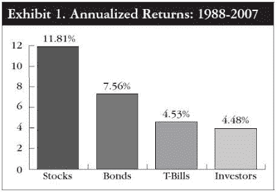

<!--yml
category: 未分类
date: 2024-05-12 20:41:15
-->

# Falkenblog: Real Investors Lag Indices by 6%

> 来源：[http://falkenblog.blogspot.com/2011/10/real-investors-lag-indices-by-6.html#0001-01-01](http://falkenblog.blogspot.com/2011/10/real-investors-lag-indices-by-6.html#0001-01-01)

I recently discovered there is considerable amount of data documenting how much investors underperform indices, and it's being ignored. In the 2008 Journal of Pension Benefits, N. Scott Pritchard

[documented](http://www.oreillywa.com/pdf/The%20Tyranny%20of%20Choice.pdf)

that that individual investors have done much worse than the indices that everyone assumes reflect investor returns. He looked at data from 401(k) plans, and found that from 1988 through 2007, while the S&P 500 returned 11.81 percent annually and Treasury bills returned 4.53 percent, the average investor achieved a return of only 4.48 percent.

Pritchard relied on the annual

[Dalbar](http://www.dalbar.com/)

study, which consolidates data from the Investment Company Institute, and is availble for investment advisers as a way to show them what the 'conventional wisdom' is on asset allocation and investor performance. More

[recent data](http://www.bemanaged.com/2011/06/28/2011-dalbar-study-finds-that-investors-are-still-their-own-worth-enemy/)

found that over the twenty years ending in 12/31/2010, the average annual equity return for investors was only 3.27%, while the S&P500 was 9.14%.

So, this 6% investor underperformance you would think would be very interesting news, because the risk premium is one of the most important facts in all of economics, being the subject of thousands of research pieces, but instead it has had about zero impact. No one finds it interesting because it is not useful to academics or investment companies.

To put this into perspective, one of the most important research findings in twentieth century finance was when two professors at the University of Chicago, James H. Lorie and Lawrence Fisher, created what has become the preeminent database on stocks in the United States, what is now known as the Center for Research on Security Prices (CRSP) database.

The front page of the New York Times financial section heralded the pair’s findings, and their

[Journal of Business article](http://www.crsp.com/50/images/rates%20of%20return%20paper.pdf)

reported the average of the rates of return on common stocks listed on the NYSE was 9 percent for the NYSE from January 30, 1926, to through 1960\. Included in the NYT article was a flattering picture of them in a room with a big computer, emphasizing that this was very scientific. Interestingly, if you read their paper, you will see how academics bury their lede by noting that this final result is not conspicuous, highlighting that academics like to emphasize their technique, not the results.

Now, this was 3% higher than the average annual return on the Dow Jones index, but with dividends added, about the same, so why the big deal? It was important because while this old data probably still contains large amounts of survivorship bias, it meticulously corrected for all sorts of other issues and therefore added the patina of academic rigor to a fundamental financial constant: the equity risk premium.

This result stood for decades, and led to many to think the equity risk premium was on the order of 6-8% up to the internet bubble of 2001\. It validated the new 'risk premium' paradigm that was being created in the early 1960s, where risk, properly measured, generates an observable return premium over time, because without higher expected returns no one would invest in risky assets. When combined with a stock's beta, it generated the expected return for each asset, making a seemingly qualitative problem one amenable to linear programming.

Much has happened since then, most importantly, the poor returns since 2000, which have reduced most estimates of the equity risk premium to around 3.5%. This excludes transaction costs, and adverse timing, which are captured in the Dalbar data. And of course this excludes taxes.