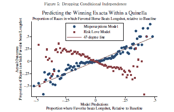

<!--yml
category: 未分类
date: 2024-05-12 20:48:11
-->

# Falkenblog: Risk-Loving or Stupidity?

> 来源：[http://falkenblog.blogspot.com/2011/08/risk-loving-or-stupidity.html#0001-01-01](http://falkenblog.blogspot.com/2011/08/risk-loving-or-stupidity.html#0001-01-01)

There are lots of cases where insanely risky assets have low, even negative returns. Highly volatile stocks have insanely poor returns. This is part of a general pattern, such as when lottery tickets with the most extreme odds have the lowest returns. The longshot bias in horseracing noted by

[Griffith in 1949](http://www.jstor.org/pss/1418469)

, and remains: 100/1 or greater loses 61%, the favorite loses only 5.5%, the average bet loses 23%.

Justin Wolfers and Erik Snowberg published an excellent paper (

[Explaining the Favorite–Long Shot Bias: Is It Risk-Love or Misperceptions?](http://bpp.wharton.upenn.edu/speaker%20files/Snowberg.pdg.pdf)

) that tests if the horseracing longshot bias is due to risk-loving or systematically overestimated probabilities. They do this by looking at horse racing returns to single horses, and for combinations such as the exacta where one chooses the first and second horses in a race. They note that if the risk-loving model is correct, one has the model

Pr(a)*U(O(a))=Pr(b)*U(O(b))

where O(a) is the odds (eg, 10-1) of horse a winning. In contrast, in the misconception (stupidity) model, the implied relation is

Pr(a)*(O(a)+1)=Pr(b)*(O(b)+1)=1

By manipulating the equations they calibrating these models to the data--returns and odds for individual horses and their combinations--they find that the misconception model works much better. Look at the graph below, and notice the misconceptions model generates a nice prediction-actual set of points (blue dots), while the risk-loving model is basically nonsensical. In horse racing, people don't love risk, they are simply overconfident.

With the advent of low volatility equity investing, the implication is that excluding the highly volatile stocks increases a portfolio's Sharpe ratio. It is important to understand if these crappy stocks--higher volatility, lower return--are due to a preference towards the wild ride, or perhaps just because people are overconfident when they buy these stocks. To the extent the poor returns to high volatility are from simple mistaken odds, it should disappear as investors become aware of this mistake. Yet there are other forces at work, including:

> Signaling: an investor with alpha applies this were it is most valuable, so investing in the most risky stock highlights your high alpha.
> Investor flow: mutual fund inflow are very convex, highlighting the importance of getting in the top decile. Fund managers rationally will choose risky portfolios to maximize their return conditional upon this.
> Alpha discovery: The best way to assess if you have alpha, is to make a choice where the returns will be stark: big win or big loss. That way, you can assess your ability better than picking a stock that only modestly out or under-performs.
> Story Telling: portfolio managers are fond of telling their clients why they own what they own. It is a lot easier to tell a story about a highly risky stock than a really safe stock, because safe stocks don't have that much going on, whereas the risky stocks have lots of conspicuous events that may or may not happen.

With these forces at work, it isn't clear that even after high volatility investing becomes well-known as having below-average returns, there still won't be an 'excess demand' for these stinkers.