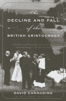

<!--yml
category: 未分类
date: 2024-05-12 21:14:03
-->

# Falkenblog: Risk Premium Doesn't Make Sense

> 来源：[http://falkenblog.blogspot.com/2010/12/risk-premium-doesnt-make-sense_15.html#0001-01-01](http://falkenblog.blogspot.com/2010/12/risk-premium-doesnt-make-sense_15.html#0001-01-01)

The idea that risk begets return comes from the idea that people don't like risk. As risk is avoidable, by say putting one's money in high quality bonds, investing in risky assets must generate a positive expected return to compensate people for such risk taking. This is the risk premium. Yet, we see again and again that risk does not beget return (see

[here](http://www.efalken.com/papers/RRsec4.html)

). Merely taking risk is not compensated.

I was reading a book

[The Decline and Fall of the British Aristocracy](http://www.amazon.com/Decline-Fall-British-Aristocracy/dp/0375703683)

, by David Cannadine, which covers 1870 through 1930\. They highlight that this was the strongest aristrocracy in Europe due to primogeniture and Britain's exceptional wealth, and so the combination of power, status and wealth was unequaled. In 1880 only 10,000 people owned 66% of the land. Yet land prices fell after 1880 due to a collapse in agricultural prices, the rising industrial sectors marginalized the rural areas that historically gave the nobility so much of their wealth, and new laws turned power irrevocably from nobles to number (the

[Third Reform Act of 1884](http://en.wikipedia.org/wiki/Representation_of_the_People_Act_1884)

).

Classical liberal Richard Cobden

[wrote](http://mises.org/books/great_wars_great_leaders_raico.pdf)

that 'the battle-plain is the harvest-field of the aristocracy, watered by the blood of the people', meaning, the aristocracy prior to 1900 generated their legitimacy via their willingness to lead groups into battle (often needlessly). As the British aristocracy declined from 1880 to 1910 they thought that World War 1 would re-establish them as the top of their country. Many were eager to fight, mainly afraid the fighting would be over before they could prove themselves in battle. Yet, while they proportionately lost more of their sons than those of other classes in WW1, the decline of the aristocracy continued unabated after the Great War. Indeed, the loss of life sharply curtailed the supply of domestic servants, and inheritance taxes went from nothing to 60% by 1939\. The lower classes felt no sense of gratitude towards the aristocracy, having lost enough themselves. Battlefield courage is admirable, but it is not sufficiently rare to generate privileged status; the lower classes were not party to such an exchange.

In retrospect, the aristocracy arrogated power via myth, tradition, and brute force, rationalized via their exception valor. The problem with their self-serving story is that many would accept a probability of death for such success, so this 'courage premium' was not a real equilibrium result, as WW1 showed. Courage was a necessary, not sufficient, condition for acquiring power. Similarly, risk taking is a necessary condition to achieving riches, not sufficient. In standard theory, you take risk, and on average you will get rich quicker than others. That's all you need, a willingness to experience the randomness.

Unfortunate jobs like cleaning sewers are generally not highly paid even though they are rather disgusting; people get used to a lot of things. In a similar way, risk taking, if all it takes is a willingness to expose oneself to some stochastic shocks, is too easy. As

[Dan Pink notes](http://www.youtube.com/watch?v=u6XAPnuFjJc&feature=player_embedded.)

, researchers have documented that monetary incentives work pretty easily for straightforward mechanical tasks, like keeping one's band in hot water for extended periods of time. Monetary incentives do not work for tasks taking some kind of creativity. In a similar way, if mere willingness to undergo stochastic shocks generate higher expected returns, it would be too easy. In real life, it's much more complicated, as intelligence is very important. You don't get paid--statistically--for merely for taking risk, however defined.

If one can expect a 5% annual return to investing in equities over bonds, then over 30 years this means quadrupling one's money relative to those who are risk averse. If that is the trade-off, I doubt anyone would choose bonds. It's a profound misunderstanding, a signature mistaken principle in finance.