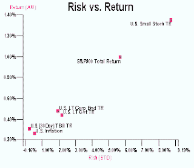

<!--yml
category: 未分类
date: 2024-05-12 21:31:45
-->

# Falkenblog: Risk-Return Bait and Switch

> 来源：[http://falkenblog.blogspot.com/2010/05/risk-return-bait-and-switch.html#0001-01-01](http://falkenblog.blogspot.com/2010/05/risk-return-bait-and-switch.html#0001-01-01)

One of my

[big ideas](http://www.efalken.com/video/index.html)

is that risk, however measured, is not positively related to (rational) expected returns. It goes up a bit as you go from Treasuries, or overnight loans, to the slightly less safe BBB bonds, or 3 year maturities. But that's it, that's all you get for merely taking the psychic pain of risk. Just as septic tank cleaners do not make more than average, or teachers of unruly students do not make more than average, merely investing in something highly volatile does not generate automatic compensation. Getting rich has never been merely an ability to withstand some obvious discomfort.

This is a big idea because the risk premium pervades modern economics like the luminiferous aether pervaded 19th century physics. It's everywhere and explains everything (eg, why did markets fluctuate yesterday? The risk premium was moving!); it is also impossible to measure. One thing it certainly is not, however, is mere volatility. High beta stocks, and high volatility stocks, ha

[ve lower than average returns](http://www.cxoadvisory.com/volatility-effects/low-risk-and-high-return/)

. All financial researchers know if risk is priced, it is a covariance with a factor that proxies our 'marginal utility of wealth', often thought to be something like the S&P500 index. It is not 'total volatility', 'total non-diversifiable volatility', or a covariance with anything, well, intuitive--we've tried everything intuitive. The theory does not work in horse racing, lotteries, junk bonds, private-equity, temporal volatility, options, within equities, options on equities, the yield curve > 3 years, among other investments.

While no one has identified this elusive factor, it's an academic snipe hunt that has been going on for 50 years, and yet academics still believe it exists the same way any true believer knows the truth regardless of evidence. The triumph of theory over data is a powerful thing.

Yet I noticed that over at Journal of Finance editor Campbell Harvey's

[website](http://www.duke.edu/~charvey/Classes/ba350/history/history.htm)

, he has the standard two-dimensional plots with risk on the x-axis, return on the y-axis, such as the one below.

Now, Campbell Harvey is a clever guy (editor of the Journal of Finance), and does a lot of solid research. Yet to conflate risk with 'standard deviation' in this presentation highlights how the mind confabulates.

The psychologist Jonathan Haidt has this

[great study](http://www.psychologytoday.com/blog/experiments-in-philosophy/200804/what-s-the-matter-little-brothersister-action)

on presenting disgusting scenarios to students, like a story about a brother and sister who decide to have sex (with full protection), and who then decide it was a fun special moment. He then asks people, 'was that wrong?' Modern students generally say they don't have a problem with people doing things that don't hurt others, and in this hypothetical, no one was hurt. Yet most everyone finds it objectionable. So when pressed as to why they don't like it, they first offer reasons like 'they will have defective children', even though the risk of pregnancy was assumed zero, or 'it's illegal', when that point is moot because this takes place in France, where it is legal.

Although we like to think of ourselves having beliefs based on painstaking rational deliberation consistent with our enlightened liberal views, Haidt sees the process as just the reverse. We judge and then we reason. Reason is the press secretary of the emotions, the

ex post facto

spin doctor of beliefs we've arrived at through a largely intuitive process. Basically, our brains don't like it, and we first reach for the obvious reasons (eg, having Prince Edward-like spawn), and when these are shown deficient, move on to others. We don't like saying, 'because I believe it to be so!' when defending our beliefs.

Harvey knows that standard deviation is not even a proxy for risk, yet when presented with a simple graph that superficially works, he uses it as proof. He cherry picks asset classes where this works, and ignores the ones where it does not. For an experienced finance academic this risk-return nexus is burned into his neurons like our aversion to the smell of toe jam, they know it's true, regardless of what the data say. It's an answer that works for his naive MBA students, and so his rationalizing

[homunculus](http://en.wikipedia.org/wiki/Homunculus)

got the better of him.

Cam Harvey responds in comments:

> ... Do I believe in a positive relation between expected risk and expected return? Yes. Is is difficult to measure risk? Definitely. It is even difficult to measure expected returns.
> 
> Finally, let me comment on your idea that "risk, however measured, is not positively related to returns." Finance theory says nothing about this. Our theory relates risk to "expected returns" not ex-post returns. To be clear, "risk" should also be expected. I emphasize this in my class. I accept your critique of my graph which should have been labeled "Average Historical Returns" vs. "Standard Deviation of Returns."