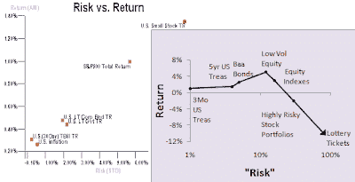

<!--yml
category: 未分类
date: 2024-05-12 21:22:21
-->

# Falkenblog: Risk and Return in General

> 来源：[http://falkenblog.blogspot.com/2010/09/risk-and-return-in-general.html#0001-01-01](http://falkenblog.blogspot.com/2010/09/risk-and-return-in-general.html#0001-01-01)

My theory is that life is like the purple chart, where risk premiums exist on Baa bonds, riding up 3 years on the yield curve, but that's it. After that risk is something we take with negative expected returns, because risky assets play into our overconfidence, signaling, and other outside-the-box needs. (regular chart is the conventional academic wisdom from Cam Harvey's

[website](http://www.duke.edu/~charvey/Classes/ba350/history/history.htm)

).

I've expanded by

[SSRN paper on risk and return](http://papers.ssrn.com/sol3/papers.cfm?abstract_id=1420356)

, adding two new sections, and updating the empirical survey. I now have sections outlining the creation of the standard model, and the history of empirical testing, so it's now a 150 page beast (but skimming is encouraged!). Indeed, I put the paper into HTML and posted it up

[here](http://www.efalken.com/RiskReturn.html)

, and you can skim around sections pretty easily there. When I put it into html the equations look kind of funny, but the pdf is pretty clear. I also have an updated set of references on asset pricing

[here](http://www.efalken.com/papers/AssetPricingRefs.html)

.

As Greg Mankiw

[argues](http://www.nytimes.com/2010/09/05/business/economy/05view.html?_r=1)

that students take economics in college, primarily finance, I think my paper is superior to the standard Corporate Finance course you will learn in college or graduate school. This is because they neglect to mention the fundamental theory that risk and expected return are positively correlated, is an empirical failure. Professors have been very successful at presenting the CAPM and its spawn as a triumph of the social sciences, in a way similar to how macroeconomists used to present Keynesian macro models before the Phillips curve started to do multiple backflips. The profs are filled with wishful thinking based on ever more obscure econometric tests that prove their big idea works, a science no less than thermodynamics. It doesn't work, not even as an approximation. You have a finite life, don't waste it on theories theories popular among professors but not practitioners. Plus, like

[Khan Academy](http://money.cnn.com/2010/08/23/technology/sal_khan_academy.fortune/index.htm)

, it's free.