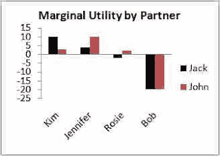
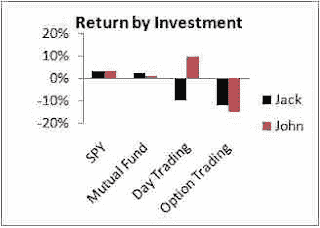
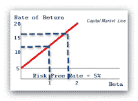

<!--yml
category: 未分类
date: 2024-05-12 20:49:10
-->

# Falkenblog: Risk is Like Sex Because...

> 来源：[http://falkenblog.blogspot.com/2011/07/risk-is-like-sex-because.html#0001-01-01](http://falkenblog.blogspot.com/2011/07/risk-is-like-sex-because.html#0001-01-01)

... its payoff depends more on context than quantity. The same investment, or sex partner, has a different value to different people. Investments that pay off have a synergy with an individual investor's particular human capital, which is why finding alpha is just as much a process of self-discovery as it is of raw ambition. If you simply allocate your money into objectively risky investments you will lose money because in general investments are like banner-ad business opportunities that play on people's naive hopes to get rich.

Obviously sex has different value depending on what, when, where, and especially who. Consider Jack and John, who have different utility payoffs of sex with the same people, sometimes even having negative value in certain cases--the sign in our utility function flips. While almost all humans enjoy sex and it is necessary for our species, the amount of sex in equilibrium is the result of millions of individual, carefully chosen transactions. Doubling it would not be an improvement even though everyone talks about how much they like it, though clearly there are institutional and ethical norms that could improve the average person's sex life. In general, sex is essential and omnipresent, but its payoff is not linear in some universal quantity metric.

Risk is also contextual. For John, who has a plausible strategy and some discipline, day trading may be a great idea, but for Jack it just churns money. CNBC-type chatter that discusses investment strategies, and companies offering trading programs, primarily churn money too, highlighting that the vast majority of information related to investing encourages bad investing (if it worked they wouldn't give it away for anything less than hundreds of thousands of dollars). For some investments like investing in broad ETFs, the returns are the same, yet these are exceptions, not the rule. Risk taking, like sex, is essential and omnipresent, and its payoff is not linear in any universal quantity metric either.

The standard theory is that risk--properly defined as the omnipresent, nondiversifiable, priced risk---is something that generates a linear payoff for everyone. If you take 2 units, you will receive 2 units of the risk premium regardless of who you are. Thus, if you think the equity risk premium is 5%, then investing in stocks with twice the equity beta should generate a 10% annualized premium, and stocks with a 0.5 beta should generate half the beta. Properly defined, it's all about the quantity of the dollar betas at work.

After 45 years of intense search, no one has found a beta that has this property.

Consider that for equities, future returns are negatively correlated with inflows, so that on average investors are poor at market timing. Further, stock substitutes have the patina of a risky asset that has demonstrated a positive return, though in general they are sucker plays. This makes the simple arithmetic average of the S&P500 a best-case scenario for your average investor, who also face taxes and significant transaction costs when they trade a lot as they often do.

Just look at the total returns to the

[ProShares](http://www.proshares.com/funds/?gclid=CNjAufjymqoCFQ7MKgodTgLmxw)

ETFs, highly popular trading vehicles that allow one to short and lever all sorts of sectors. For 90 funds with data since Jan 2010, the average return through July 2011 has been -4% while the boring SPY was up 21%. When you look at all the ways to invest, people are adversely selected by hucksters as they always have and always will. Risk takers need a realistic contingent strategy (including exit and a way to lever that strategy if it works). That's quite different than saying that once you've identified risk, anyone and everyone will get the same linear return based on how much money they throw into it.