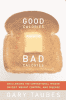

<!--yml
category: 未分类
date: 2024-05-12 20:56:07
-->

# Falkenblog: Salt May Not be Unhealthy

> 来源：[http://falkenblog.blogspot.com/2011/05/salt-may-not-be-unhealthy.html#0001-01-01](http://falkenblog.blogspot.com/2011/05/salt-may-not-be-unhealthy.html#0001-01-01)

[Gary Taubes](http://www.garytaubes.com/)

wrote

[What if It's All Been a Big Fat Lie?](http://www.nytimes.com/2002/07/07/magazine/what-if-it-s-all-been-a-big-fat-lie.html)

back in 2002 for the New York Times Magazine, which reinvigorated the Atkins/Southbeach/Paleo diets. He argues carbohydrates put us on an insulin treadmill, whereas proteins and fats satiate us. It seems the key effect is on your appetite via insulin regulation and the stability of going into fat burning mode, as opposed to some calories having different effects on your weight.

But he's a pretty interesting guy in general. His Blogginheads

[interview](http://bloggingheads.tv/diavlogs/35831)

on last weekend's Science Saturday was pretty neat. He

[also wrote back in 1998](http://www.sciencemag.org/content/281/5379/898.short)

that the conventional wisdom on salt could be wrong too, with correlation not equaling causation. Indeed, there are a lot of bad correlations purported to be causations in medicine and biology, and it makes me skeptical of statins. Anyway, here's good news for salt lovers from a New York Times

[article](http://www.nytimes.com/2011/05/04/health/research/04salt.html?hp)

on a study that included 3,681 middle-aged Europeans who did not have high blood pressure or cardiovascular disease and followed them for an average of 7.9 years.

> A new study found that low-salt diets increase the risk of death from heart attacks and strokes and do not prevent high blood pressure, but the research’s limitations mean the debate over the effects of salt in the diet is far from over. In fact, officials at the Centers for Disease Control and Prevention felt so strongly that the study was flawed that they criticized it in an interview, something they normally do not do.
> 
> The investigators found that the less salt people ate, the more likely they were to die of heart disease – 50 people in the lowest third of salt consumption (2.5 grams of sodium per day) died during the study as compared with 24 in the medium group (3.9 grams of sodium per day) and 10 in the highest salt consumption group (6.0 grams of sodium per day). And while those eating the most salt had, on average, a slight increase in systolic blood pressure — a 1.71-millimeter increase in pressure for each 2.5-gram increase in sodium per day — they were no more likely to develop hypertension.