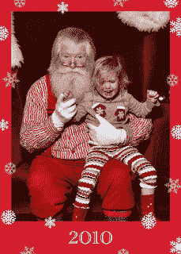

<!--yml
category: 未分类
date: 2024-05-12 21:14:18
-->

# Falkenblog: Scary Santa

> 来源：[http://falkenblog.blogspot.com/2010/12/scary-santa.html#0001-01-01](http://falkenblog.blogspot.com/2010/12/scary-santa.html#0001-01-01)

My little princess Izzie (3.5 y.o.) had been apprehensive about sitting with Santa, but finally mentioned she was up for a

tête à tête

to inform him of her interests in Easy-Bake Ovens and Pillow Pets. I capitalized on the chance. After a half hour in line, as we got closer to the big guy, she started mentioning second thoughts. I was in an evil mood, and handed screaming Izzie to their helper-elf, who assured her that this was not the Bad Santa from the mall across town. She was unpersuaded. I told the elf I had cash and I had my orders, so to the horror of the other children watching we basically water-boarded the child in front of them. Merry Xmas!