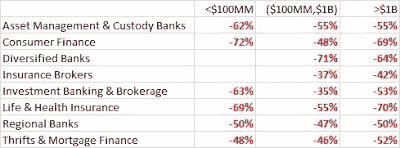

<!--yml
category: 未分类
date: 2024-05-12 22:09:09
-->

# Falkenblog: Scope of Financial Crisis

> 来源：[http://falkenblog.blogspot.com/2009/04/scope-of-financial-crisis.html#0001-01-01](http://falkenblog.blogspot.com/2009/04/scope-of-financial-crisis.html#0001-01-01)

One interesting puzzle of this crisis is that while it started with mortgages, it affected every financial sector pretty similarly. Below are the total returns from April 30 2008 through March 31 2009, for a variety of financial institutions with market cap greater than $30MM as of April 2008 (about 800 firms).

Stock Returns By Sub Industry From 4/30/08 - 3/31/09 

One would think that size or industry would highlight those with the most direct mortgage ownership. It suggests that while mortgages may have started the crisis, the real problem was the amplification process that decimated everything. To this day only mortgage backed debt has had abnormally large loss rates. Speculative grade defaults for 2008 were 4.1%, which makes it the 12th worst year in the last 30, hardly consistent with the market debacle of the past 12 months. Auto loans, credit cards, etc. have reported an increase in losses, but are holding up pretty well. Everyone expects them to get much worse, but that's a forecast.

A similar issue is the performance across countries, where the US is actually doing better than most countries. This is all quite puzzling, as it appears the amplification mechanism is much more important than the initial cause. I don't really understand that mechanism.