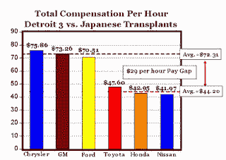

<!--yml
category: 未分类
date: 2024-05-12 22:46:39
-->

# Falkenblog: Senate Hearing on Autos

> 来源：[http://falkenblog.blogspot.com/2008/11/senate-hearing-on-autos.html#0001-01-01](http://falkenblog.blogspot.com/2008/11/senate-hearing-on-autos.html#0001-01-01)

I was watching the senate

[banking committee hearing](http://www.nytimes.com/2008/11/19/business/19auto.html?_r=1&hp)

, where the CEOs of the big Three US auto companies, the UAW leader, and an awesome economist named Peter Morici were giving testimony. It was very good, in the sense that everyone gave a clear argument, and with the economist, we had a little debate. Unlike Sunday talk shows, there were fewer bold claims of fact because they knew they were on the record, and so a material and negligent or misleading statement could engender liability. Further, they got a long time to talk, without commercial interruption.

One fact that seems material, is when Gettelfinger, the UAW president,

[testified](http://www.freep.com/article/20081118/BUSINESS01/81118057)

that "one industry analyst has indicated that labor costs for the Detroit-based auto companies will actually be lower than those for Toyota’s U.S. operations". That seems wildly at odd with the data below. I suppose if you exclude legacy costs, and costs for existing workers and the union rules and the job bank, that might be true, but that's excluding a lot. Considering the burn rate, I don't see why we have to wait until 2010 for these cost savings to show: if they want our money, why not demand they lower their costs now.

The sad thing is, even given this relatively well-run forum of opinions by experts, they still end up passing legislation they do.