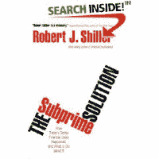

<!--yml
category: 未分类
date: 2024-05-12 23:00:18
-->

# Falkenblog: Shiller Called The Housing Bubble?

> 来源：[http://falkenblog.blogspot.com/2008/09/shiller-called-housing-bubble.html#0001-01-01](http://falkenblog.blogspot.com/2008/09/shiller-called-housing-bubble.html#0001-01-01)

The latest financial guru to call the housing bubble is Robert Shiller, famous for actually calling the internet bubble in real time. But his latest book,

[The Subprime Solution](http://www.amazon.com/gp/product/product-description/0691139296/ref=dp_proddesc_0?ie=UTF8&n=283155&s=books)

, seems to imply that he called the housing bubble. I haven't read the book, but blurbatious Lawrence Summers says "Robert Shiller is two for two in predicting and identifying bubbles that will burst". The WSJ book review

[notes](http://online.wsj.com/article/SB122039984625593039.html?mod=opinion_main_commentaries)

"He was among the first well-known economists to predict that the U.S. housing boom would end with crashing prices." These comments are lacking concrete references.

So I'm looking at

Irrational Exuberance

, 2nd edition, written in 2005\. There's a neat graph of housing prices from 1890 to 2005, and there is a sharp increase in the years 1997-2005\. But then there's lots of 'buts', 'ifs', and 'yets': prices went up a lot after WW2 and didn't collapse, the rise is much less than the internet bubble, etc. The most definitive statement he makes is that 'housing is looking like a bad long-term investment relative to the stock market'...but then immediately qualifies this by noting the tax benefits of owning a home, and the implicit dividends of living in a home.

He was intrigued about the home price increase, but that's about it. He gave the typical economist 'on the one hand...on the other hand...' prediction. He was not 'short housing', just wary about its long run investment potential, which one could say about everything.