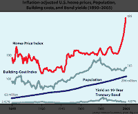

<!--yml
category: 未分类
date: 2024-05-12 22:15:37
-->

# Falkenblog: Shiller Did Not Call the Bubble

> 来源：[http://falkenblog.blogspot.com/2009/03/shiller-did-not-call-bubble.html#0001-01-01](http://falkenblog.blogspot.com/2009/03/shiller-did-not-call-bubble.html#0001-01-01)

In Shiller's

[Irrational Exubrance](http://en.wikipedia.org/wiki/Irrational_Exuberance_(book))

, 2nd edition, there is a section on the housing prices, and a graph showing housing prices rising. But there are literally pages of qualifications, about how this price rise cannot continue, but not much about housing prices falling much in nominal terms. I was struck by this graph from a

[blog](http://dailybail.com/home/the-great-unclog-of-2009-industrial-strength-drano-anyone.html)

that seems spot on. Unfortunately, the book had a picture that did not have anything after 2004 (see below), the prices just go up, so there's a healthy bit of photoshopping going on.

I've seen him introduced various times as calling the housing bubble. If you actually read the book, you read about how “In cities where prices have gotten so high that many people cannot afford to live there, the price increases may start to slowdown, and then to fall. At the same time, it is likely the boom will continue for quite a while in other cities [page 206].” That's economese for prices are expected to fluctuate.