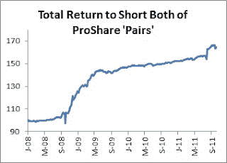

<!--yml
category: 未分类
date: 2024-05-12 20:41:35
-->

# Falkenblog: Shorting Leveraged ETF Pairs

> 来源：[http://falkenblog.blogspot.com/2011/10/shorting-leveraged-etf-pairs.html#0001-01-01](http://falkenblog.blogspot.com/2011/10/shorting-leveraged-etf-pairs.html#0001-01-01)

[ProShares](http://www.proshares.com/)

offers a wildly successful array of Exchange Traded Funds (ETFs) that allows people to easily gain leverage and short targeted subsets of stocks. They trade a lot, and so clearly are satisfying consumer preferences, but probably the more delusional part of investor beliefs. Their explicit goal of targeting a daily benchmark return correlation leaves the secondary consideration less important: maximizing long term return. Thus, they tend to underperform their benchmark over longer durations, and this adds up. I suspect they end up burning money trading so much in a way that traders can anticipate and game.

If the Proshares are underperforming, there's a simple arbitrage here. Take the 'Ultras', which offer 2x leverage, and the 'UltraShorts', which offer the opposite, -2x exposure. Going short both stocks generates a very low-risk portfolio pair, because on a daily basis when one goes up 1% the other will almost surely go down about 1% by design; the positions will offset each other. But the drift for both is negative, as they burn money. Since ProShares has been very busy adding ETFs, this simulated strategy started with 23 pairs in 2008, and is now up to 45\. Below is a graph of the total return to going short all the Ultra and UltraShort pairs offered by Proshares since 2008\. I rebalanced every week. The annual return was 14%, and the annualized standard deviation was 12%.

Now, I am ignoring the short rebate, which for these may have been highly negative for some of these, but on average these have pretty meager short rates. As the S&P500 has a prospective Sharpe of 0.3 (excess return of 5% and standard deviation of 15%), this is a very dominant strategy. Notice that while the annualized vol is 12%, this really overestimates the risk here because most of this volatility is 'good': sometimes returns are much higher than average. It's a rather Madoff looking strategy

Another way to shade this is to notice that it works best during periods of high volatility, and among those pairs with the highest volatility. Notice that the October 2008 to March 2009 was a great time for this strategy, and so was August 2011, when markets were reeling.

Below are the returns to the various pairs I used, annualized. You can also use these pairs to simulate them yourself. Over time, I suppose these ETFs should start trading at a discount to their net asset value, but until then, it's a pretty simple strategy that seems to work.

Total Return to Short Pairs

| pair1 | pair2 | AnnRet |
| AGQ | ZSL | 31.8% |
| BIB | BIS | 3.7% |
| DDM | DXD | 9.0% |
| DIG | DUG | 18.8% |
| EET | EEV | 7.7% |
| EFO | EFU | 8.0% |
| EZJ | EWV | 6.6% |
| LTL | TLL | 16.2% |
| MVV | MZZ | 8.5% |
| QLD | QID | 10.2% |
| ROM | REW | 7.9% |
| RXL | RXD | 5.2% |
| SAA | SDD | 10.4% |
| SSO | SDS | 9.6% |
| TQQQ | SQQQ | 3.0% |
| UBR | BZQ | 1.1% |
| UBT | TBT | 4.8% |
| UCC | SCC | 7.3% |
| UCD | CMD | 6.5% |
| UCO | SCO | 5.7% |
| UDOW | SDOW | 5.3% |
| UGE | SZK | 5.6% |
| UGL | GLL | 8.1% |
| UKF | SFK | 7.6% |
| UKK | SKK | 12.8% |
| UKW | SDK | 7.9% |
| UMDD | SMDD | 5.9% |
| UMX | SMK | 5.8% |
| UPRO | SPXU | 4.5% |
| UPV | EPV | 17.0% |
| UPW | SDP | 13.8% |
| URE | SRS | 51.8% |
| URTY | SRTY | 13.9% |
| USD | SSG | 10.2% |
| UST | PST | 3.8% |
| UVG | SJF | 10.7% |
| UVT | SJH | 14.7% |
| UVU | SJL | 20.1% |
| UWC | TWQ | 2.5% |
| UWM | TWM | 12.6% |
| UXI | SIJ | 5.9% |
| UXJ | JPX | 4.7% |
| UYG | SKF | 30.8% |
| UYM | SMN | 11.0% |
| XPP | FXP | 7.1% |