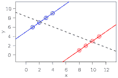

<!--yml
category: 未分类
date: 2024-05-12 21:06:13
-->

# Falkenblog: Simpson's Paradox

> 来源：[http://falkenblog.blogspot.com/2011/03/simpsons-paradox.html#0001-01-01](http://falkenblog.blogspot.com/2011/03/simpsons-paradox.html#0001-01-01)

Last week, Paul Krugman

[argued](http://www.nytimes.com/2011/02/28/opinion/28krugman.html?partner=rssnyt&emc=rss)

that kids in Wisconsin outperform kids in Texas, which to him implied this was due to the collective bargaining rights of Wisconsin educators (Texas does not have those).

IowaHawk

[noted](http://iowahawk.typepad.com/iowahawk/2011/03/longhorns-17-badgers-1.html)

this finding isn't what it appears. As he notes:

> white students in Texas perform better than white students in Wisconsin,black students in Texas perform better than black students in Wisconsin,Hispanic students in Texas perform better than Hispanic students in Wisconsin.

So, on average Wisconsin outperforms Texas, but within each ethnicity, Texas outperforms Wisconsin. As ethnic performance varies predictably across all states, ignoring the ethnic composition of states is really misleading, and is why my state, Minnesota, appears to do so well on these simple measures.

It's the old

[Simpson's Paradox!](http://en.wikipedia.org/wiki/Simpson's_paradox)

It's a really fun issue that pops up often, and good to be aware of because it's one of those cases where an omitted variables bias is at work. That is, the effect of x on y shows a significant coefficient, but when you include another variable, the coefficient on x goes to zero or even changes sign. This usually shows up in a simple cross-tabulation, and it's good practice to always be looking for other variables that could affect your findings, because if you are trying to make money like I am, it's good to know the truth (if your a partisan shill it's a minor annoyance).

Here's my application of Simpson's Paradox to the CAPM, something I go over in Finding Alpha (this is from Chapter 1 of

[my videos](http://www.efalken.com/video/index.html)

):

[http://www.youtube.com/embed/45Wzd9JEzyA](http://www.youtube.com/embed/45Wzd9JEzyA)

VIDEO

One could also adjust for price and also find this gets rid of the positive relation between beta and average returns. Much of the apparent relation between price or size and returns, meanwhile, is the result of measurement errors such as the delisting bias and the problems of geometric averaging (I know CRSP

[says](http://www.crsp.com/crsp/resources/papers/crsp_white_paper_delist_returns.pdf)

they got rid of the delisting bias, but there's still a huge low-price premium in their data, and that's obviously not obtainable, as evidenced by the failure of low-priced funds that were popular in the late 80's--now gone).