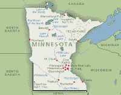

<!--yml
category: 未分类
date: 2024-05-12 20:43:34
-->

# Falkenblog: Sims and Sargent

> 来源：[http://falkenblog.blogspot.com/2011/10/sims-and-sargent.html#0001-01-01](http://falkenblog.blogspot.com/2011/10/sims-and-sargent.html#0001-01-01)

Minnesota Rules (that's where I live)! My favorite

[Sargent paper](http://www.minneapolisfed.org/research/qr/qr531.pdf)

shows a model where even when inflation is a strictly monetary phenomenon, inflation it is really, in the long run, a fiscal phenomenon.

Chris Sims--who I've mentioned several times on this blog--is

[here](http://www.eduardoloria.name/articulos/Sims.pdf)

. He basically destroyed interest in large-scale-macro-models, at least for anyone graduating subsequent to his seminal papers.

They will certainly help increase the Nobel Laureate signal/noise ratio, which currently is on par with those 'anarchists for big government' protesters. Though Sargent is, fundamentally, a macroeconomist, which means he says

[many silly things.](http://falkenblog.blogspot.com/2010/11/tom-sargent-on-macro-alls-well.html)