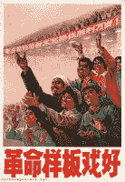

<!--yml
category: 未分类
date: 2024-05-12 21:07:14
-->

# Falkenblog: Social Progress

> 来源：[http://falkenblog.blogspot.com/2011/02/social-progress.html#0001-01-01](http://falkenblog.blogspot.com/2011/02/social-progress.html#0001-01-01)

I'm generally pessimistic about societal trends, yet there are some positive ones. An interesting

[article](http://www.foreignpolicy.com/articles/2011/01/12/irony_is_good)

in Foreign Policy notes that communist China was rather childlike in their absence of irony:

> "Socialism is great!" Was there ever a statement riper for ironic mockery than this erstwhile catchphrase of the infant Chinese republic? How could a thinking people accept this and a host of other bald statements at face value, without so much as a raised eyebrow or a silently murmured really?...As early as 1942, seven years before the founding of the People's Republic, Chairman Mao was explaining to government leaders and intellectuals that the purpose of art and culture was to serve political ends... One of the most popular [model operas], "The Great Proletarian Cultural Revolution," began with this catchy intro:
> 
> The Great Proletarian Cultural Revolution is good,
> It is good,
> It is good,
> It is good.

I think fewer things would be more grating on my sensibilities than listening to such banalities. There are few things I like less than fawning praise, because invariably it is either insincere or trite.

But it's not just irony where the West shines. If you read

[Fark](http://www.fark.com/)

daily like I do, you appreciate the anihillation of cliches. One thing that shows up are issues related to 'trolling', something your average old person is rather unaware of. As 'know your meme'

[describes trolling](http://knowyourmeme.com/memes/trolling)

:

> A troll is someone who will state something only with the intention of stirring up controversy. Typically the statement is so absurd that only the most noobish of [noobs](http://www.urbandictionary.com/define.php?term=noob) will get offended and respond...Successful trolling brings [lulz](http://www.urbandictionary.com/define.php?term=lulz) — pleasure at the expense of others. By participating in flamewars with a troll they become your puppetmaster, manipulating your emotions for their own enjoyment.
> 
> If you respond to a troll, you are said to be feeding the troll. You’ve got better things to do than feed trolls.

As Neal Stephenson

[noted](http://www.goodreads.com/quotes/show/64560)

back in 2002:

> Arguing with anonymous strangers on the Internet is a sucker's game because they almost always turn out to be—or to be indistinguishable from—self-righteous sixteen-year-olds possessing infinite amounts of free time.

Irony. Learning to not feed the trolls. These are significant subtle advances in societal wisdom.